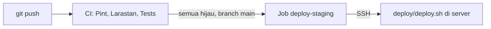

# Deployment Staging

| Atribut | Nilai |
|---|---|
| Tanggal | 26 September 2026 |
| Acuan | Roadmap M0.2, PRD §12.3 |

## Alur



- Workflow ada di [`.github/workflows/ci.yml`](../.github/workflows/ci.yml). Pint, Larastan, dan test berjalan di setiap push dan pull request.
- Job `deploy-staging` hanya berjalan untuk push ke `main`, setelah ketiga job lain lulus.
- Selama variabel repository `STAGING_HOST` belum diisi, job deploy berstatus *skipped*, bukan gagal. CI tetap hijau sebelum server siap.
- [`deploy/deploy.sh`](../deploy/deploy.sh) menjalankan: `git reset` ke commit yang lulus CI, `composer install --no-dev`, `npm run build`, `migrate --force`, `access:sync-roles` (permission baru ikut ke semua tenant), cache config/route/view/Filament, lalu `horizon:terminate` agar Supervisor menyalakan ulang worker dengan kode baru.

Deploy dilakukan di tempat (tanpa rilis bersimbol link). Cukup untuk staging; untuk produksi pertimbangkan rilis zero-downtime.

## Kebutuhan server

| Komponen | Versi / catatan |
|---|---|
| OS | Ubuntu 24.04 LTS |
| PHP | 8.5 (CLI + FPM). `composer.lock` butuh minimal 8.4.1 |
| Ekstensi PHP | bcmath, curl, gd, intl, mbstring, mysql, redis, xml, zip. `pcntl` dan `posix` wajib untuk Horizon (tersedia di PHP CLI Linux) |
| Database | MySQL 8.4 |
| Queue & cache | Redis 7 |
| Build aset | Node.js 22+ dan npm |
| Lainnya | Nginx, Composer 2, Supervisor, git, cron |

## Setup server pertama kali

Contoh memakai user `deploy` dan direktori `/var/www/agentickost`.

1. **Akses repository.** Buat SSH key di server (`ssh-keygen -t ed25519`), daftarkan public key sebagai *deploy key* (read-only) di GitHub, lalu clone:

   ```sh
   git clone git@github.com:<org>/<repo>.git /var/www/agentickost
   ```

2. **Database.** Buat database dan user khusus:

   ```sql
   CREATE DATABASE agentickost CHARACTER SET utf8mb4 COLLATE utf8mb4_unicode_ci;
   CREATE USER 'agentickost'@'localhost' IDENTIFIED BY '<password>';
   GRANT ALL PRIVILEGES ON agentickost.* TO 'agentickost'@'localhost';
   ```

3. **`.env`.** Salin dari `.env.example`, lalu ubah minimal nilai berikut:

   ```dotenv
   APP_ENV=staging
   APP_DEBUG=false
   APP_URL=https://staging.<domain>

   LOG_STACK=daily

   DB_DATABASE=agentickost
   DB_USERNAME=agentickost
   DB_PASSWORD=<password>

   QUEUE_CONNECTION=redis
   CACHE_STORE=redis
   FILESYSTEM_DISK=s3

   AWS_ACCESS_KEY_ID=<key>
   AWS_SECRET_ACCESS_KEY=<secret>
   AWS_DEFAULT_REGION=<region>
   AWS_BUCKET=<bucket>
   AWS_ENDPOINT=<endpoint S3-compatible>
   AWS_USE_PATH_STYLE_ENDPOINT=true

   IDENTITY_HASH_KEY=<hasil: php -r "echo base64_encode(random_bytes(32)), PHP_EOL;">

   SENTRY_LARAVEL_DSN=<DSN dari project Sentry>
   SENTRY_ENVIRONMENT=staging
   SENTRY_TRACES_SAMPLE_RATE=0.1
   ```

4. **Instalasi awal.**

   ```sh
   cd /var/www/agentickost
   php artisan key:generate
   bash deploy/deploy.sh origin/main
   php artisan make:filament-user --panel=admin
   ```

   Perintah terakhir membuat akun super admin untuk panel `/admin`. Akun yang sama dipakai untuk membuka `/horizon`.

5. **Nginx.** Contoh site config (`/etc/nginx/sites-available/agentickost`), sesuaikan domain dan versi PHP-FPM, lalu pasang TLS dengan Certbot:

   ```nginx
   server {
       listen 80;
       server_name staging.<domain>;
       root /var/www/agentickost/public;

       add_header X-Frame-Options "SAMEORIGIN";
       add_header X-Content-Type-Options "nosniff";

       index index.php;
       charset utf-8;
       client_max_body_size 20M;

       location / {
           try_files $uri $uri/ /index.php?$query_string;
       }

       location = /favicon.ico { access_log off; log_not_found off; }
       location = /robots.txt  { access_log off; log_not_found off; }

       error_page 404 /index.php;

       location ~ ^/index\.php(/|$) {
           fastcgi_pass unix:/run/php/php8.5-fpm.sock;
           fastcgi_param SCRIPT_FILENAME $realpath_root$fastcgi_script_name;
           include fastcgi_params;
           fastcgi_hide_header X-Powered-By;
       }

       location ~ /\.(?!well-known).* {
           deny all;
       }
   }
   ```

6. **Horizon lewat Supervisor.** `/etc/supervisor/conf.d/agentickost-horizon.conf`:

   ```ini
   [program:agentickost-horizon]
   process_name=%(program_name)s
   command=php /var/www/agentickost/artisan horizon
   user=deploy
   autostart=true
   autorestart=true
   stopwaitsecs=3600
   redirect_stderr=true
   stdout_logfile=/var/www/agentickost/storage/logs/horizon.log
   ```

   Lalu `sudo supervisorctl reread && sudo supervisorctl update`.

7. **Scheduler.** Tambahkan ke crontab user `deploy`:

   ```cron
   * * * * * cd /var/www/agentickost && php artisan schedule:run >> /dev/null 2>&1
   ```

   Scheduler juga menjalankan `horizon:snapshot` tiap 5 menit untuk metrik dashboard Horizon.

## Konfigurasi GitHub

1. Jadikan `main` sebagai branch default.
2. Buat environment `staging` (Settings → Environments).
3. Buat SSH key khusus CI, pasang public key-nya di `~/.ssh/authorized_keys` milik user `deploy` di server.
4. Isi **variables** repository:

   | Nama | Isi |
   |---|---|
   | `STAGING_HOST` | Host atau IP server. Mengisi ini mengaktifkan job deploy |
   | `STAGING_USER` | `deploy` |
   | `STAGING_PATH` | `/var/www/agentickost` |
   | `STAGING_PORT` | Opsional, default `22` |

5. Isi **secrets** di environment `staging`:

   | Nama | Isi |
   |---|---|
   | `STAGING_SSH_KEY` | Private key dari langkah 3 |
   | `STAGING_KNOWN_HOSTS` | Keluaran `ssh-keyscan -p <port> <host>` |

## Object storage

Binary MinIO edisi komunitas tidak lagi didistribusikan (`dl.min.io` mengembalikan HTTP 410), jadi opsi "MinIO di VPS" pada PRD §12.3 perlu ditinjau ulang. Pilihan yang tersisa:

- **Self-host SeaweedFS** di VPS: `weed mini` atau `weed server -s3`. Sudah diuji di lingkungan lokal dengan disk `s3` aplikasi ini.
- **Layanan S3-compatible terkelola.** Pertimbangkan lokasi data center terkait UU PDP (PRD §11.3).

Aplikasi hanya butuh endpoint S3-compatible, jadi pilihan ini bisa diganti tanpa perubahan kode. Disk `s3` diset `throw => true` agar kegagalan tulis tidak diam-diam diabaikan.

## Error tracking

1. Buat project Laravel di Sentry.
2. Isi `SENTRY_LARAVEL_DSN` dan `SENTRY_ENVIRONMENT` di `.env` server.
3. Uji dengan `php artisan sentry:test`.

Exception dilaporkan lewat `Integration::handles()` di [`bootstrap/app.php`](../bootstrap/app.php). Di test suite, DSN dikosongkan di `phpunit.xml`.
