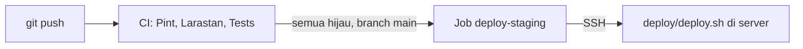

# Deployment Staging

| Atribut | Nilai |
|---|---|
| Tanggal | 26 September 2026 |
| Acuan | Roadmap M0.2, PRD §12.3 |

## Alur



- Workflow ada di [`.github/workflows/ci.yml`](../.github/workflows/ci.yml). Pint, Larastan, dan test berjalan di setiap push dan pull request.
- Job `deploy-staging` hanya berjalan untuk push ke `main`, setelah ketiga job lain lulus.
- Selama variabel repository `STAGING_HOST` belum diisi, job deploy berstatus *skipped*, bukan gagal. CI tetap hijau sebelum server siap.
- [`deploy/deploy.sh`](../deploy/deploy.sh) menjalankan: `git reset` ke commit yang lulus CI, `composer install --no-dev`, `npm run build`, `migrate --force`, `access:sync-roles` (permission baru ikut ke semua tenant), cache config/route/view/Filament, lalu `horizon:terminate` agar Supervisor menyalakan ulang worker dengan kode baru.

Deploy dilakukan di tempat (tanpa rilis bersimbol link). Cukup untuk staging; untuk produksi pertimbangkan rilis zero-downtime.

## Kebutuhan server

| Komponen | Versi / catatan |
|---|---|
| OS | Ubuntu 24.04 LTS |
| PHP | 8.5 (CLI + FPM). `composer.lock` butuh minimal 8.4.1 |
| Ekstensi PHP | bcmath, curl, gd, intl, mbstring, mysql, redis, xml, zip. `pcntl` dan `posix` wajib untuk Horizon (tersedia di PHP CLI Linux) |
| Database | MySQL 8.4 |
| Queue & cache | Redis 7 |
| Build aset | Node.js 22+ dan npm |
| Lainnya | Nginx, Composer 2, Supervisor, git, cron |

## Setup server pertama kali

Contoh memakai user `deploy` dan direktori `/var/www/agentickost`.

1. **Akses repository.** Buat SSH key di server (`ssh-keygen -t ed25519`), daftarkan public key sebagai *deploy key* (read-only) di GitHub, lalu clone:

   ```sh
   git clone git@github.com:<org>/<repo>.git /var/www/agentickost
   ```

2. **Database.** Buat database dan user khusus:

   ```sql
   CREATE DATABASE agentickost CHARACTER SET utf8mb4 COLLATE utf8mb4_unicode_ci;
   CREATE USER 'agentickost'@'localhost' IDENTIFIED BY '<password>';
   GRANT ALL PRIVILEGES ON agentickost.* TO 'agentickost'@'localhost';
   ```

3. **`.env`.** Salin dari `.env.example`, lalu ubah minimal nilai berikut:

   ```dotenv
   APP_ENV=staging
   APP_DEBUG=false
   APP_URL=https://staging.<domain>

   LOG_STACK=json
   LOG_LEVEL=info

   SESSION_ENCRYPT=true

   DB_DATABASE=agentickost
   DB_USERNAME=agentickost
   DB_PASSWORD=<password>

   QUEUE_CONNECTION=redis
   CACHE_STORE=redis
   FILESYSTEM_DISK=s3

   AWS_ACCESS_KEY_ID=<key>
   AWS_SECRET_ACCESS_KEY=<secret>
   AWS_DEFAULT_REGION=<region>
   AWS_BUCKET=<bucket>
   AWS_ENDPOINT=<endpoint S3-compatible>
   AWS_USE_PATH_STYLE_ENDPOINT=true

   IDENTITY_HASH_KEY=<hasil: php -r "echo base64_encode(random_bytes(32)), PHP_EOL;">

   SENTRY_LARAVEL_DSN=<DSN dari project Sentry>
   SENTRY_ENVIRONMENT=staging
   SENTRY_TRACES_SAMPLE_RATE=0.1
   ```

4. **Instalasi awal.**

   ```sh
   cd /var/www/agentickost
   php artisan key:generate
   bash deploy/deploy.sh origin/main
   php artisan make:filament-user --panel=admin
   ```

   Perintah terakhir membuat akun super admin untuk panel `/admin`. Akun yang sama dipakai untuk membuka `/horizon`.

5. **Nginx.** Contoh site config (`/etc/nginx/sites-available/agentickost`), sesuaikan domain dan versi PHP-FPM, lalu pasang TLS dengan Certbot:

   ```nginx
   server {
       listen 80;
       server_name staging.<domain>;
       root /var/www/agentickost/public;

       index index.php;
       charset utf-8;
       client_max_body_size 20M;

       location / {
           try_files $uri $uri/ /index.php?$query_string;
       }

       location = /favicon.ico { access_log off; log_not_found off; }
       location = /robots.txt  { access_log off; log_not_found off; }

       error_page 404 /index.php;

       location ~ ^/index\.php(/|$) {
           fastcgi_pass unix:/run/php/php8.5-fpm.sock;
           fastcgi_param SCRIPT_FILENAME $realpath_root$fastcgi_script_name;
           include fastcgi_params;
           fastcgi_hide_header X-Powered-By;
       }

       location ~ /\.(?!well-known).* {
           deny all;
       }
   }
   ```

6. **Horizon lewat Supervisor.** `/etc/supervisor/conf.d/agentickost-horizon.conf`:

   ```ini
   [program:agentickost-horizon]
   process_name=%(program_name)s
   command=php /var/www/agentickost/artisan horizon
   user=deploy
   autostart=true
   autorestart=true
   stopwaitsecs=3600
   redirect_stderr=true
   stdout_logfile=/var/www/agentickost/storage/logs/horizon.log
   ```

   Lalu `sudo supervisorctl reread && sudo supervisorctl update`.

7. **Scheduler.** Tambahkan ke crontab user `deploy`:

   ```cron
   * * * * * cd /var/www/agentickost && php artisan schedule:run >> /dev/null 2>&1
   ```

   Scheduler juga menjalankan `horizon:snapshot` tiap 5 menit untuk metrik dashboard Horizon.

## Konfigurasi GitHub

1. Jadikan `main` sebagai branch default.
2. Buat environment `staging` (Settings → Environments).
3. Buat SSH key khusus CI, pasang public key-nya di `~/.ssh/authorized_keys` milik user `deploy` di server.
4. Isi **variables** repository:

   | Nama | Isi |
   |---|---|
   | `STAGING_HOST` | Host atau IP server. Mengisi ini mengaktifkan job deploy |
   | `STAGING_USER` | `deploy` |
   | `STAGING_PATH` | `/var/www/agentickost` |
   | `STAGING_PORT` | Opsional, default `22` |

5. Isi **secrets** di environment `staging`:

   | Nama | Isi |
   |---|---|
   | `STAGING_SSH_KEY` | Private key dari langkah 3 |
   | `STAGING_KNOWN_HOSTS` | Keluaran `ssh-keyscan -p <port> <host>` |

## Object storage

Binary MinIO edisi komunitas tidak lagi didistribusikan (`dl.min.io` mengembalikan HTTP 410), jadi opsi "MinIO di VPS" pada PRD §12.3 perlu ditinjau ulang. Pilihan yang tersisa:

- **Self-host SeaweedFS** di VPS: `weed mini` atau `weed server -s3`. Sudah diuji di lingkungan lokal dengan disk `s3` aplikasi ini.
- **Layanan S3-compatible terkelola.** Pertimbangkan lokasi data center terkait UU PDP (PRD §11.3).

Aplikasi hanya butuh endpoint S3-compatible, jadi pilihan ini bisa diganti tanpa perubahan kode. Disk `s3` diset `throw => true` agar kegagalan tulis tidak diam-diam diabaikan.

## Error tracking

1. Buat project Laravel di Sentry.
2. Isi `SENTRY_LARAVEL_DSN` dan `SENTRY_ENVIRONMENT` di `.env` server.
3. Uji dengan `php artisan sentry:test`.

Exception dilaporkan lewat `Integration::handles()` di [`bootstrap/app.php`](../bootstrap/app.php). Di test suite, DSN dikosongkan di `phpunit.xml`.

Exception dari job antrian yang gagal juga masuk Sentry lewat handler yang sama.

## Kesiapan produksi

Checklist sebelum data kost pilot masuk (roadmap M1.10). Semua perintah dijalankan scheduler; yang perlu disiapkan hanya server, kredensial, dan Sentry.

### Pengaturan `.env` produksi

| Nilai | Alasan |
|---|---|
| `APP_ENV=production`, `APP_DEBUG=false` | Tanpa halaman error berisi kode. Horizon hanya terbuka untuk super admin bila `APP_ENV` bukan `local` |
| `SESSION_ENCRYPT=true` | Notifikasi yang memuat nomor identitas tersimpan terenkripsi di sesi |
| `SESSION_SECURE_COOKIE` | Tidak perlu diisi: di luar `local` dan `testing` cookie sesi otomatis hanya lewat HTTPS |
| `LOG_STACK=json` | Log satu objek JSON per baris di `storage/logs/laravel.json-*.log` (NFR-OBS-01) |

Aplikasi sendiri mengirim header keamanan (X-Frame-Options, nosniff, Referrer-Policy, Permissions-Policy, dan HSTS bila lewat HTTPS), termasuk di halaman error, jadi Nginx tidak perlu menambahkannya. Di luar `local` dan `testing`, password harus berisi huruf dan angka dan tidak ada di daftar password bocor (dicek ke layanan Have I Been Pwned).

### Kunci yang wajib disimpan terpisah

Simpan `APP_KEY` dan `IDENTITY_HASH_KEY` di password manager tim, di luar server. Nomor dan foto identitas penghuni dienkripsi dengan `APP_KEY`: backup database tanpa kunci ini tidak bisa membuka data identitas.

### Pemantauan job (NFR-OBS-01)

Setiap job terjadwal di [`routes/console.php`](../routes/console.php) melapor ke Sentry Crons lewat `->sentryMonitor()`. Sentry memberi alert bila job gagal atau tidak berjalan sesuai jadwal, misalnya karena cron atau server mati. Monitor terdaftar otomatis saat job pertama kali berjalan; atur penerima alert di Sentry (Alerts → Crons).

Job lintas tenant (terbit tagihan, denda, perpanjangan, pengingat) memproses setiap tenant dan setiap kontrak atau tagihan secara terpisah. Bila satu gagal, yang lain tetap diproses, error dilaporkan ke Sentry, dan job berakhir gagal sehingga monitor memberi alert.

### Backup (NFR-BKP-01 sampai NFR-BKP-04)

| Job | Jadwal | Isi |
|---|---|---|
| `backup:database` | Setiap hari 02:00 WIB | Dump penuh satu snapshot (`mysqldump --single-transaction`), dikompres, dikirim ke disk `backups`. Dump lebih tua dari `BACKUP_KEEP_DAYS` (35) dihapus |
| `backup:binlogs` | Setiap jam, menit ke-30 | Menutup binary log yang sedang berjalan, lalu menyalin setiap log yang sudah tertutup dan belum tersalin. Data yang bisa hilang paling banyak sekitar satu jam (RPO NFR-BKP-02) |
| `backup:restore-test` | Tanggal 1 setiap bulan pukul 21:00 UTC (tanggal 2, 04:00 WIB) | Memulihkan dump terakhir ke database sementara, mengecek tabel inti dan keseimbangan setiap jurnal, lalu menghapus database sementara (NFR-BKP-04) |

Persiapan server:

1. **Lokasi terpisah (NFR-BKP-03).** Buat bucket khusus backup di penyedia atau region lain dari server dan bucket berkas aplikasi. Bucket harus privat; aktifkan enkripsi di sisi penyedia bila tersedia. Isi di `.env`:

   ```dotenv
   BACKUP_S3_KEY=<key>
   BACKUP_S3_SECRET=<secret>
   BACKUP_S3_REGION=<region>
   BACKUP_S3_BUCKET=<bucket backup>
   BACKUP_S3_ENDPOINT=<endpoint>
   ```

2. **Alat MySQL.** `apt install mysql-client` menyediakan `mysqldump`, `mysql`, dan `mysqlbinlog`. Bila tidak ada di PATH, isi `BACKUP_MYSQLDUMP`, `BACKUP_MYSQL`, `BACKUP_MYSQLBINLOG`.

3. **Akun backup.** Backup memakai akun sendiri dengan hak yang tidak dimiliki user aplikasi:

   ```sql
   CREATE USER 'agentickost_backup'@'localhost' IDENTIFIED BY '<password>';
   GRANT SELECT, SHOW VIEW, TRIGGER, LOCK TABLES, EVENT ON agentickost.* TO 'agentickost_backup'@'localhost';
   GRANT RELOAD, REPLICATION CLIENT, REPLICATION SLAVE, SESSION_VARIABLES_ADMIN ON *.* TO 'agentickost_backup'@'localhost';
   GRANT ALL PRIVILEGES ON agentickost_restore_test.* TO 'agentickost_backup'@'localhost';
   ```

   `SESSION_VARIABLES_ADMIN` dipakai uji pulih untuk mematikan binary log di sesinya sendiri, supaya isi dump tidak tercatat ulang dan membengkakkan backup binary log. Lalu isi `BACKUP_DB_USERNAME` dan `BACKUP_DB_PASSWORD` di `.env`. Password ditulis ke berkas opsi sementara (mode 600) saat perintah berjalan, tidak pernah di baris perintah.

4. **Binary log.** MySQL 8.4 menyalakannya secara default. Pastikan di `/etc/mysql/mysql.conf.d/mysqld.cnf`:

   ```ini
   log_bin = binlog
   binlog_format = ROW
   binlog_expire_logs_seconds = 604800
   ```

   Tujuh hari di server cukup karena salinannya ada di bucket backup.

5. **Uji pertama.** Jalankan `php artisan backup:database`, `php artisan backup:binlogs`, lalu `php artisan backup:restore-test`. Ketiganya harus berhasil sebelum data pilot masuk.

### Pemulihan ke titik waktu tertentu

Target pemulihan 4 jam (RTO NFR-BKP-02). Langkahnya, misalnya untuk kembali ke keadaan 5 Oktober 2026 pukul 14:55 WIB (07:55 UTC):

1. Hentikan aplikasi (`php artisan down`) dan worker (`supervisorctl stop agentickost-horizon`).
2. Unduh dump terakhir sebelum waktu tujuan dari `database/` di bucket backup, dan semua berkas di `binlog/` sesudahnya. Ekstrak dengan `gunzip`.
3. Buat database kosong, lalu muat dump:

   ```sh
   mysql -e "CREATE DATABASE agentickost_pulih CHARACTER SET utf8mb4 COLLATE utf8mb4_unicode_ci"
   mysql agentickost_pulih < agentickost-20261004-190000.sql
   ```

4. Cari posisi binary log saat dump dibuat, di baris awal dump:

   ```sh
   grep -m1 "CHANGE REPLICATION SOURCE TO" agentickost-20261004-190000.sql
   # -- CHANGE REPLICATION SOURCE TO SOURCE_LOG_FILE='binlog.000123', SOURCE_LOG_POS=4567;
   ```

5. Putar ulang binary log dari posisi itu sampai sebelum waktu tujuan (waktu dalam zona waktu server MySQL, UTC):

   ```sh
   mysqlbinlog --start-position=4567 --stop-datetime="2026-10-05 07:55:00" \
     --rewrite-db="agentickost->agentickost_pulih" --database=agentickost_pulih \
     binlog.000123 binlog.000124 binlog.000125 | mysql agentickost_pulih
   ```

   `--database` memakai nama baru karena mysqlbinlog mengganti nama database lebih dulu, baru menyaring. `--start-position` hanya berlaku untuk berkas pertama.

6. Periksa isinya (jumlah tenant, tagihan terakhir, jurnal seimbang), lalu arahkan `DB_DATABASE` ke `agentickost_pulih`, atau ganti nama database lama. Jalankan `php artisan up` dan nyalakan worker lagi.

