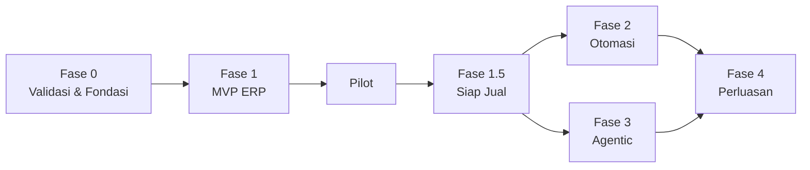
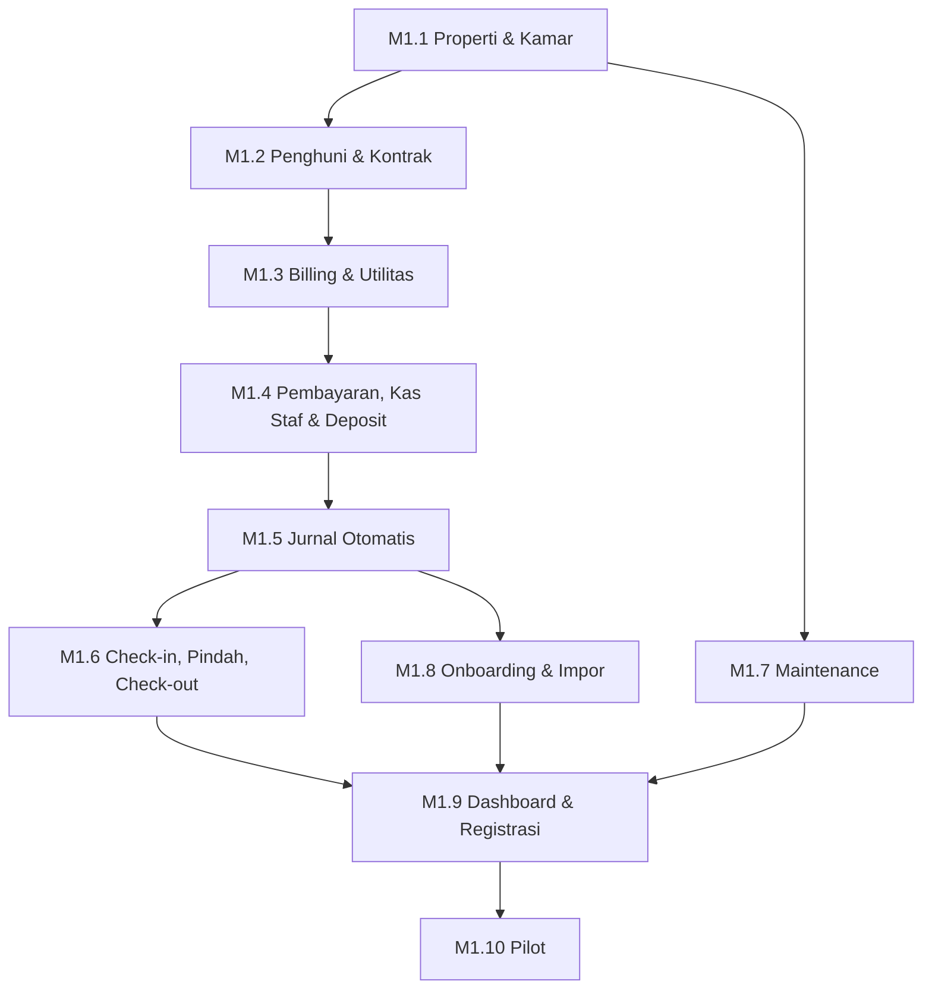

# Roadmap — KostPilot

| Atribut | Nilai |
|---|---|
| Versi | 0.1 (Draft) |
| Tanggal | 25 September 2026 |
| Acuan | [`docs/prd.md`](./prd.md) |
| Status proyek | Belum ada kode (Fase 0) |

Dokumen ini menerjemahkan PRD menjadi urutan kerja. Kode modul (`PRP`, `BIL`, dst.) dan ID requirement (`FR-…`, `NFR-…`) merujuk ke PRD.

---

## Cara Pakai

- Centang `[x]` setiap tugas yang selesai dan commit perubahan file ini bersama kodenya.
- Satu milestone dianggap selesai hanya jika **semua kriteria selesai** terpenuhi, bukan sekadar semua tugas tercentang.
- Jangan mulai milestone berikutnya jika milestone sebelumnya yang menjadi dependensinya belum selesai.
- Fitur baru di luar roadmap dicatat di bagian **Parkir** (paling bawah), bukan langsung dikerjakan.

### Asumsi estimasi

Estimasi di bawah adalah perkiraan kasar untuk **1 developer, sekitar 20 jam per minggu**. Sesuaikan jika jumlah orang atau jam kerja berbeda. Estimasi diperbarui di akhir setiap fase berdasarkan kecepatan nyata.

---

## Ringkasan Fase

| Fase | Fokus | Estimasi | Kriteria selesai |
|---|---|---|---|
| **0** | Validasi produk & fondasi teknis | 3–4 minggu | Masalah prioritas terkonfirmasi; project siap dengan tenancy dan test isolasi |
| **1** | MVP ERP (semua modul P0) | 14–20 minggu | 2–3 kost pilot menjalankan satu siklus tagihan penuh tanpa kembali ke Excel |
| **1.5** | Siap jual (P1 inti) | 6–8 minggu | Owner bisa daftar, trial, bayar langganan, dan onboarding sendiri |
| **2** | Otomasi & perluasan P1 | 6–8 minggu | Pengingat, denda, dan booking berjalan tanpa campur tangan manual |
| **3** | Lapisan agentic | 8–12 minggu | Agent verifikasi dan penagihan memenuhi target akurasi di tenant uji |
| **4** | Perluasan P2 | Berdasarkan permintaan | Dikerjakan sesuai prioritas tenant berbayar |

Fase 2 dan Fase 3 dapat berjalan paralel jika tim lebih dari satu orang.

---

## Fase 0 — Validasi & Fondasi

### M0.1 Validasi produk

- [ ] Susun daftar calon narasumber owner kost (target 3–5 orang, campuran kecil dan menengah)
- [ ] Wawancara menggunakan panduan di Lampiran A
- [ ] Rangkum temuan: masalah paling sakit, cara kerja sekarang, kesediaan membayar
- [ ] Putuskan segmen target awal (PRD §18 no. 1)
- [ ] Tetapkan nilai default aturan bisnis: masa tenggang, tipe denda, urutan alokasi (PRD §18 no. 7)
- [x] Putuskan dukungan kost harian/mingguan di MVP atau tidak (PRD §18 no. 6): didukung penuh, lihat `docs/adr/0008-keputusan-mvp.md`
- [ ] Dapatkan 2–3 calon kost pilot yang bersedia mencoba
- [ ] Perbarui PRD sesuai temuan

**Kriteria selesai:** minimal 3 wawancara terdokumentasi, segmen target diputuskan, minimal 2 calon pilot bersedia.

### M0.2 Setup project

- [x] Buat `CLAUDE.md` / `AGENTS.md` yang merujuk ke PRD
- [x] Konfigurasi MySQL, Redis, dan Laravel Horizon
- [x] Install Filament; buat dua panel: `admin` (super admin) dan `app` (owner & staf)
- [x] Setup testing (Pest atau PHPUnit) dengan database test terpisah
- [x] Setup code style (Laravel Pint) dan static analysis (Larastan)
- [x] Setup CI (GitHub Actions): test, Pint, Larastan di setiap push dan pull request: belum pernah berjalan karena repo belum punya remote GitHub
- [ ] Konfigurasi object storage S3-compatible untuk lingkungan lokal dan staging: lokal selesai (SeaweedFS); staging menunggu pilihan penyedia, lihat `docs/deployment.md`
- [x] Setup error tracking: Sentry terpasang; DSN diisi saat project Sentry dibuat
- [ ] Siapkan server staging dan alur deploy otomatis dari branch utama: alur deploy siap (`deploy/deploy.sh`, job `deploy-staging`); server belum ada
- [x] Atur zona waktu aplikasi ke UTC (NFR-LOC-02)

**Kriteria selesai:** `git push` menjalankan CI hijau dan men-deploy ke staging secara otomatis.

### M0.3 Fondasi arsitektur

- [x] Buat struktur `app/Modules/` beserta mekanisme registrasi service provider per modul (PRD §12.4)
- [x] Tetapkan pola Action class: satu kelas satu operasi, dibungkus transaksi database, memeriksa permission
- [x] Model `Tenant` dan relasi user ke tenant
- [x] Trait `BelongsToTenant`: isi `tenant_id` otomatis dan pasang global scope (NFR-ISO-01)
- [x] Middleware penentu konteks tenant dari user login
- [x] Mekanisme membawa konteks tenant ke job antrian dan perintah terjadwal (NFR-ISO-02)
- [x] Awalan tenant pada kunci cache dan path storage (NFR-ISO-03, NFR-ISO-04)
- [x] **Harness test isolasi tenant** yang otomatis dijalankan untuk setiap model baru (NFR-ISO-05): lapisan model; uji lewat UI/API ditambah saat resource pertama dibuat
- [x] Role dan permission dasar (Owner, Manajer, Penjaga, Akuntan, Penghuni) dengan pembatasan per properti: peran Penghuni baru dipakai di portal penghuni (M1.5.3)
- [x] Audit log dengan tipe aktor: user, sistem, agent, super admin (FR-USR-04)
- [x] Konvensi uang: cast integer rupiah dan helper format (PRD §8.1)
- [x] Pasang dan uji library state machine: contoh di `tests/Fixtures`; state machine domain pertama (status kamar) di M1.1
- [x] Tulis catatan keputusan arsitektur singkat di `docs/adr/`

**Kriteria selesai:** test isolasi membuktikan user tenant A tidak dapat mengakses data tenant B pada model contoh; pola Action, audit log, dan state machine punya contoh yang berjalan dan teruji.

---

## Fase 1 — MVP ERP

Urutan milestone mengikuti dependensi data: entitas dasar → kontrak → tagihan → pembayaran → jurnal → alur yang memakai semuanya.

### M1.1 Properti & Kamar — `PRP`, `KMR`

- [x] CRUD properti dengan zona waktu dan jenis kost (FR-PRP-01, FR-PRP-02): batas jumlah properti per paket menunggu modul langganan (M1.5.1)
- [x] Rekening tujuan per properti (FR-PRP-03)
- [x] Pengaturan properti: siklus tagihan, prorata, denda, alokasi, notice period, pembulatan (FR-PRP-04)
- [x] Tipe kamar dengan harga per periode sewa (FR-KMR-01)
- [x] CRUD kamar dengan kapasitas dan override harga (FR-KMR-02)
- [x] Riwayat harga dengan tanggal berlaku (FR-KMR-03)
- [x] State machine status kamar (FR-KMR-04, PRD §9.1)
- [x] Grid kamar per properti (FR-KMR-05), lengkap dengan penghuni dan tunggakan
- [x] Penugasan staf ke properti

**Kriteria selesai:** owner dapat menyiapkan satu properti lengkap dengan kamar dan harga; transisi status kamar yang tidak sah ditolak dan teruji.

### M1.2 Penghuni & Kontrak — `PNH`, `KTR`

- [x] Profil penghuni dengan dokumen identitas terenkripsi (FR-PNH-01, FR-PNH-02, NFR-SEC-01)
- [x] Pembayar terpisah dari penghuni dan pengaturan penerima notifikasi (FR-PNH-03, FR-PNH-04): pengiriman notifikasinya di M1.5.4
- [x] Catatan internal per tenant (FR-PNH-06)
- [x] Kontrak dengan harga terkunci, periode bayar, dan deposit (FR-KTR-01)
- [x] Multi-penghuni per kamar dengan pembagian tagihan (FR-KTR-02): satu tagihan per kontrak, pembagian per orang hanya informasi (ADR 0008)
- [x] State machine kontrak (PRD §9.3)
- [x] Perpanjangan kontrak dan pengingat kontrak berakhir (FR-KTR-03)
- [x] Pemutusan dini dengan penalti (FR-KTR-04): penalti ditagihkan di penyelesaian check-out (M1.6)
- [x] Kebijakan hold saat libur panjang (FR-KTR-05): dipakai mesin tagihan di M1.3
- [x] PDF kontrak bermerek tenant (FR-KTR-06)
- [x] Log akses dokumen identitas (NFR-PDP-04)

**Kriteria selesai:** kontrak dapat dibuat, diperpanjang, dan diputus; perubahan harga kamar tidak memengaruhi kontrak berjalan (teruji).

### M1.3 Billing & Utilitas — `BIL`, `UTL`

Milestone paling berisiko. Kerjakan dengan test lebih dulu.

- [x] Tulis test untuk seluruh aturan PRD §8.1–8.4 sebelum implementasi
- [x] Model tagihan dan komponen tagihan (FR-BIL-02)
- [x] Mode siklus anniversary dan tanggal tetap, termasuk kasus tanggal 29–31 (PRD §8.2)
- [x] Kalkulator prorata dengan basis hari aktual dan 30 hari (FR-BIL-03, PRD §8.3)
- [x] Job terbit tagihan harian per zona waktu properti (FR-BIL-01): berjalan tiap jam agar pergantian hari WIB, WITA, dan WIT tertangkap
- [x] Pratinjau tagihan sebelum terbit massal
- [x] Mesin denda: masa tenggang, flat/harian/persen, batas maksimum (FR-BIL-04, PRD §8.4)
- [x] Penghapusan denda dengan alasan dan audit
- [x] Tagihan manual ad-hoc (FR-BIL-05)
- [x] Void dan credit note; larangan edit dan hapus (FR-BIL-06, PRD §8.10)
- [x] Penomoran tagihan per tenant (FR-BIL-07)
- [x] PDF tagihan dan tautan berbagi (FR-BIL-08)
- [x] Status "telat" dihitung, bukan disimpan (PRD §9.4)
- [x] Model utilitas: pascabayar, token, flat (FR-UTL-01)
- [x] Input meteran dengan foto dan validasi (FR-UTL-02, FR-UTL-03)
- [x] Pemakaian utilitas masuk ke tagihan (FR-UTL-04)

**Kriteria selesai:** semua test aturan §8.1–8.4 lulus, termasuk contoh prorata Rp440.000 di PRD; tagihan satu bulan untuk satu properti terbit benar tanpa koreksi manual.

### M1.4 Pembayaran, Kas Staf & Deposit — `PAY` (P0), `DEP`

- [x] Test alokasi pembayaran sesuai PRD §8.5 sebelum implementasi
- [x] Pencatatan pembayaran manual transfer dan tunai (FR-PAY-01)
- [x] Unggah bukti transfer dan antrian verifikasi (FR-PAY-02, FR-PAY-03): bukti diunggah staf; unggah oleh penghuni sendiri menunggu portal (M1.5.3)
- [x] Pembayaran parsial dan multi-tagihan dengan alokasi otomatis dan manual (FR-PAY-04)
- [x] Saldo kredit dari kelebihan bayar (FR-PAY-05): dipakai otomatis saat tagihan berikutnya terbit; nota kredit pada tagihan lunas juga menjadi saldo kredit
- [x] Pembalikan pembayaran (PRD §8.10)
- [x] Kuitansi PDF (FR-PAY-06), dengan tautan berbagi
- [x] Kas di tangan staf dan setoran dengan penanda selisih (FR-PAY-07, FR-PAY-08, PRD §8.12)
- [x] Ledger deposit: terima, potong, refund, pindah (FR-DEP-01 sampai FR-DEP-03), termasuk bayar tagihan dari deposit atas persetujuan owner
- [x] Laporan deposit dipegang per properti (FR-DEP-04)

**Kriteria selesai:** skenario bayar parsial, lebih bayar, bayar tunai lewat penjaga, dan setoran dengan selisih semuanya teruji dan menghasilkan saldo yang benar.

### M1.5 Jurnal Otomatis — `ACC` (P0)

- [x] Bagan akun bawaan dan akun tambahan per tenant (FR-ACC-01)
- [x] Listener jurnal untuk setiap peristiwa di PRD §8.14, dalam transaksi yang sama (FR-ACC-02): DP booking dan saldo awal menyusul bersama booking (M2.1) dan onboarding (M1.8)
- [x] Test keseimbangan: setiap jurnal total debit sama dengan total kredit (NFR-QA-02)
- [x] Pencatatan pengeluaran per properti (FR-ACC-03)
- [x] Multi akun kas/bank (FR-ACC-04)
- [x] Buku besar sederhana per akun untuk verifikasi

**Kriteria selesai:** satu siklus lengkap (tagihan, bayar, deposit, pengeluaran) menghasilkan buku besar yang seimbang dan cocok dengan saldo kas.

### M1.6 Check-in, Pindah Kamar, Check-out — `SIK`

- [x] Check-in dengan checklist dan foto (FR-SIK-01): persetujuan penghuni dicatat staf; konfirmasi dari penghuni sendiri menunggu portal (M1.5.3)
- [x] Pindah kamar dengan prorata dan penyesuaian deposit (FR-SIK-02, PRD §8.8)
- [x] Pengajuan keluar dengan notice period (FR-SIK-03): pengajuan oleh penghuni sendiri menunggu portal (M1.5.3)
- [x] Pemeriksaan check-out dan daftar kerusakan (FR-SIK-04)
- [x] Penyelesaian akhir: tagihan akhir atau refund (FR-SIK-05, PRD §8.9)

**Kriteria selesai:** skenario pindah kamar di tengah bulan dan check-out dengan potongan deposit teruji, termasuk jurnalnya.

### M1.7 Maintenance — `MNT` (P0)

- [x] Tiket dengan kategori, prioritas, dan foto (FR-MNT-01): laporan dari penghuni sendiri menunggu portal (M1.5.3)
- [x] State machine tiket dan penugasan (FR-MNT-02, PRD §9.5): penugasan ke vendor menyusul bersama data vendor (M2.2)
- [x] Foto sebelum dan sesudah (FR-MNT-03)
- [x] Biaya perbaikan menjadi pengeluaran (FR-MNT-04)
- [x] Biaya ditagihkan ke penghuni (FR-MNT-05)

**Kriteria selesai:** tiket dapat dibuat oleh staf, diselesaikan, dan biayanya muncul di pengeluaran atau tagihan penghuni.

### M1.8 Onboarding & Impor — `ONB`

- [ ] Wizard setup awal (FR-ONB-01)
- [ ] Template Excel untuk kamar, penghuni, dan kontrak (FR-ONB-02)
- [ ] Pratinjau impor dengan error per baris; impor all-or-nothing (FR-ONB-03)
- [ ] Input saldo awal: tunggakan, deposit, kas/bank per tanggal cut-off (FR-ONB-04)
- [ ] Jurnal pembuka otomatis (FR-ONB-05)
- [ ] Checklist onboarding di dashboard (FR-ONB-06)

**Kriteria selesai:** data nyata dari minimal satu calon pilot berhasil diimpor dan saldo awalnya cocok dengan catatan owner.

### M1.9 Dashboard & Registrasi — `RPT` (P0), `TNT`

- [ ] Dashboard: okupansi, pendapatan bulan berjalan, tunggakan, tiket terbuka, pembayaran menunggu (FR-RPT-01)
- [ ] Daftar tunggakan per penghuni (FR-RPT-02)
- [ ] Registrasi mandiri dan verifikasi akun (FR-TNT-01, FR-TNT-02)
- [ ] Masa trial (FR-TNT-03)
- [ ] Panel super admin: daftar tenant dan status (FR-TNT-04)
- [ ] Impersonasi dengan alasan dan audit (FR-TNT-05)
- [ ] Bekukan dan aktifkan tenant (FR-TNT-06)
- [ ] Undang staf lewat email (FR-USR-03)

**Kriteria selesai:** tenant baru dapat mendaftar sendiri sampai melihat dashboard; super admin dapat mengelola tenant.

### M1.10 Pilot

- [ ] Checklist kesiapan produksi: backup harian dan binary log, uji restore, error tracking, alert job gagal (NFR-BKP-01 sampai NFR-BKP-04, NFR-OBS-01)
- [ ] Audit keamanan dasar sebelum data nyata masuk (NFR-SEC-04)
- [ ] Onboarding 2–3 kost pilot, didampingi langsung
- [ ] Jalankan minimal satu siklus tagihan penuh di setiap kost pilot
- [ ] Kumpulkan masukan mingguan dan catat di Parkir atau backlog
- [ ] Ukur metrik awal: waktu verifikasi, ketepatan bayar (PRD §15.1)
- [ ] Tetapkan target angka metrik untuk fase berikutnya
- [ ] Perbarui PRD dan roadmap berdasarkan hasil pilot

**Kriteria selesai Fase 1:** 2–3 kost pilot menjalankan satu siklus tagihan penuh tanpa kembali ke Excel, dan tidak ada kebocoran data antar tenant.

---

## Fase 1.5 — Siap Jual

### Keputusan yang wajib diambil sebelum mulai

- [ ] Struktur dan harga paket langganan (PRD §18 no. 2)
- [ ] Penyedia WhatsApp dan model integrasinya (PRD §18 no. 3, §14.3)
- [ ] Penyedia payment gateway dan model akun tenant, dikonfirmasi ke penyedia soal aspek regulasi (PRD §18 no. 4, §14.2)
- [ ] Teknologi portal penghuni (PRD §18 no. 5)
- [ ] Durasi trial dan masa retensi data (PRD §18 no. 9)
- [ ] Nama produk final (PRD §18 no. 8)

### M1.5.1 Langganan & Paket — `SUB`

- [ ] Model paket dengan batas penggunaan (FR-SUB-01)
- [ ] Feature flag per paket (FR-SUB-02)
- [ ] Tagihan langganan dan pembayaran lewat payment gateway platform (FR-SUB-03)
- [ ] State machine langganan: trial, aktif, masa tenggang, read-only, dibekukan (FR-SUB-04, PRD §9.6)
- [ ] Upgrade dan downgrade dengan validasi batas (FR-SUB-05)
- [ ] Ekspor seluruh data tenant (FR-SUB-06)
- [ ] Branding per tenant: logo, nama, warna aksen (FR-SUB-07)

### M1.5.2 Payment Gateway Tenant — `PAY` (P1)

- [ ] Penyimpanan kredensial payment gateway tenant terenkripsi (NFR-SEC-02)
- [ ] Pembuatan virtual account / QRIS per tagihan (FR-PAY-09)
- [ ] Webhook idempoten dengan log (FR-PAY-10)
- [ ] Test webhook ganda dan webhook datang tidak berurutan

### M1.5.3 Portal Penghuni — `PRT`

- [ ] Login dengan OTP WhatsApp (FR-PRT-01)
- [ ] Tagihan, riwayat bayar, kontrak, saldo deposit (FR-PRT-02)
- [ ] Bayar lewat payment gateway atau unggah bukti (FR-PRT-03)
- [ ] Buat dan pantau tiket (FR-PRT-04)
- [ ] Pengumuman properti (FR-PRT-05)
- [ ] Instalasi sebagai PWA (FR-PRT-06)
- [ ] Akses terbatas untuk pembayar non-penghuni (FR-PRT-07)
- [ ] Test isolasi: penghuni tidak dapat melihat data penghuni lain, bahkan di tenant yang sama

### M1.5.4 Notifikasi — `NTF`

- [ ] Abstraksi `MessageChannel` dengan implementasi WhatsApp dan email (PRD §14.3)
- [ ] Template pesan per tenant dengan variabel (FR-NTF-01)
- [ ] Pengingat tagihan terjadwal yang dapat dikonfigurasi (FR-NTF-02)
- [ ] Pengumuman broadcast (FR-NTF-04)
- [ ] Log pengiriman dan status (FR-NTF-05)
- [ ] Notifikasi dalam aplikasi (FR-NTF-06)

### M1.5.5 Akuntansi & Laporan Lanjutan — `ACC` (P1), `RPT` (P1)

- [ ] Jurnal manual (FR-ACC-05)
- [ ] Laba rugi, neraca, arus kas per properti dan konsolidasi (FR-ACC-06)
- [ ] Laporan versi kas (FR-ACC-07)
- [ ] Tutup buku per periode (FR-ACC-08, PRD §8.11)
- [ ] Aging piutang (FR-RPT-03)
- [ ] Ekspor Excel dan PDF (FR-RPT-05)
- [ ] Ekspor data penghuni untuk RT/RW (FR-PNH-07)

### M1.5.6 Keamanan & Legal

- [ ] Autentikasi dua faktor untuk Owner, Akuntan, dan super admin (FR-USR-05, NFR-SEC-05)
- [ ] Rate limiting login, OTP, dan endpoint publik (NFR-SEC-03)
- [ ] Syarat layanan, kebijakan privasi, dan perjanjian pemrosesan data, ditinjau pihak yang memahami hukum (NFR-PDP-01)
- [ ] Mekanisme permintaan hapus dan ekspor data pribadi penghuni (NFR-PDP-03)
- [ ] Job anonimisasi sesuai retensi (NFR-PDP-02)

### M1.5.7 Peluncuran

- [ ] Landing page dengan penjelasan manfaat dan harga
- [ ] Panduan penggunaan singkat dan video onboarding
- [ ] Kanal dukungan pelanggan
- [ ] Program referral sederhana
- [ ] Konversi kost pilot menjadi pelanggan berbayar

**Kriteria selesai Fase 1.5:** owner baru dapat menemukan produk, mendaftar, trial, onboarding, dan membayar langganan tanpa bantuan tim; minimal satu tenant pilot beralih ke berbayar.

---

## Fase 2 — Otomasi & Perluasan P1

### M2.1 CRM & Booking — `CRM`, `BKG`

- [ ] Leads dengan sumber dan pipeline (FR-CRM-01, FR-CRM-02)
- [ ] Jadwal survey dengan pengingat (FR-CRM-03)
- [ ] Waitlist per tipe kamar (FR-CRM-04)
- [ ] Hold kamar dengan kedaluwarsa otomatis (FR-BKG-01)
- [ ] DP booking dan jurnal uang muka (FR-BKG-02)
- [ ] Pencegahan booking tumpang tindih, termasuk uji konkurensi (FR-BKG-03)
- [ ] Validasi jenis kost (FR-BKG-04)
- [ ] Kebijakan pembatalan (FR-BKG-05, PRD §8.7)
- [ ] Konversi booking ke kontrak (FR-BKG-06)

### M2.2 Operasional Lanjutan — `INV`, `VND`, `MNT` (P1)

- [ ] Inventaris aset dan riwayat servis (FR-INV-01, FR-INV-02)
- [ ] Daftar vendor (FR-VND-01)
- [ ] Target waktu respons tiket (FR-MNT-06)
- [ ] Jadwal perawatan rutin (FR-MNT-07)

### M2.3 Lapangan & Laporan

- [ ] Input meteran saat koneksi lemah dengan sinkronisasi (FR-UTL-05)
- [ ] Laporan kamar lama kosong, churn, biaya maintenance per kamar (FR-RPT-04)
- [ ] Peran kustom (FR-USR-01)

**Kriteria selesai Fase 2:** pengingat, denda, hold booking, dan perawatan rutin berjalan otomatis di seluruh tenant tanpa campur tangan manual selama satu bulan penuh.

---

## Fase 3 — Lapisan Agentic

Urutan agent dipilih dari yang dampaknya paling terukur dan risikonya paling terkendali.

### M3.1 Infrastruktur Agent — `AGT`

- [ ] Modul `Agent` dan registri tool yang dibangun dari Action class (PRD §10.1)
- [ ] Pembatasan tool per jenis agent (PRD §10.4)
- [ ] Pencatatan `agent_runs` dan `agent_tool_calls` (PRD §10.6)
- [ ] Antrian persetujuan untuk aksi T2 di panel dan WhatsApp (PRD §10.3)
- [ ] Kuota kredit AI per tenant dan fallback ke rule-based (PRD §10.6)
- [ ] Identifikasi pengirim dari nomor terdaftar (PRD §10.4)
- [ ] Penanda pesan otomatis dan mekanisme alih ke manusia (PRD §10.5)
- [ ] Sakelar aktif/nonaktif agent per properti dan per jenis
- [ ] Set uji prompt injection yang dijalankan di CI

### M3.2 Agent Verifikasi Pembayaran

- [ ] Ekstraksi nominal, tanggal, dan rekening dari bukti transfer
- [ ] Pencocokan ke tagihan terbuka dan usulan verifikasi (selalu T2 pada awalnya)
- [ ] Ukur akurasi terhadap keputusan manusia (PRD §15.3)
- [ ] Opsi verifikasi otomatis per tenant dengan syarat ketat (PRD §10.3)

### M3.3 Agent Penagihan

- [ ] Pengingat berjenjang yang menyesuaikan riwayat bayar penghuni
- [ ] Eskalasi tunggakan lama ke owner
- [ ] Bandingkan ketepatan bayar dengan pengingat rule-based

### M3.4 Agent Calon Penghuni

- [ ] Jawaban ketersediaan dan harga dari data kamar
- [ ] Penjadwalan survey dan pembuatan lead
- [ ] Hold kamar (T1)
- [ ] Ukur tingkat penyelesaian tanpa manusia

### M3.5 Agent Komplain

- [ ] Klasifikasi keluhan dan pembuatan tiket
- [ ] Konfirmasi penyelesaian ke penghuni

### M3.6 Agent Laporan

- [ ] Ringkasan mingguan untuk owner
- [ ] Temuan otomatis: kamar lama kosong, lonjakan biaya, tunggakan memburuk

### M3.7 Evaluasi berkelanjutan

- [ ] Proses tinjauan sampel percakapan dan keputusan agent
- [ ] Dashboard biaya LLM per tenant

**Kriteria selesai Fase 3:** agent verifikasi dan penagihan memenuhi target akurasi dan biaya yang ditetapkan setelah pilot; tidak ada aksi T2 yang terjadi tanpa persetujuan dalam uji prompt injection.

---

## Fase 4 — Perluasan P2

Dikerjakan berdasarkan permintaan tenant berbayar, bukan berurutan.

- [ ] Pajak daerah (FR-TAX-01, FR-TAX-02)
- [ ] Layanan tambahan (FR-ADD-01, FR-ADD-02)
- [ ] Tamu dan pelanggaran (FR-SEC-01, FR-SEC-02)
- [ ] Staf dan penggajian sederhana (FR-VND-02)
- [ ] Tanda tangan elektronik kontrak (FR-KTR-07)
- [ ] Rekonsiliasi mutasi bank (FR-ACC-09)

---

## Definition of Done (berlaku untuk setiap tugas)

- [ ] Logika bisnis berada di Action class, bukan di controller atau komponen Filament
- [ ] Model data tenant memakai `BelongsToTenant` dan lulus test isolasi
- [ ] Aturan bisnis yang disentuh punya test
- [ ] Aksi yang mengubah data tercatat di audit log
- [ ] Permission diperiksa
- [ ] Tampilan dapat dipakai di layar ponsel
- [ ] CI hijau (test, Pint, Larastan)
- [ ] Sudah dicoba di staging
- [ ] PRD diperbarui jika perilaku berbeda dari yang tertulis

---

## Menjaga Cakupan

- Fitur yang tidak ada di PRD dicatat di bagian Parkir, lalu ditinjau di akhir setiap fase.
- Jika sebuah milestone melampaui estimasi lebih dari 50%, hentikan sejenak dan pecah ulang atau pangkas cakupannya.
- Prioritas selalu: benar secara keuangan → data tenant aman → mudah dipakai → fitur tambahan.

---

## Lampiran A — Panduan Wawancara Owner Kost

Tujuannya memahami cara kerja dan masalah nyata, bukan menjual produk. Hindari menjelaskan solusi sebelum pertanyaan selesai.

1. Berapa kamar dan properti yang Anda kelola, dan siapa saja yang ikut mengurus?
2. Ceritakan dari awal sampai akhir bagaimana Anda menagih dan menerima pembayaran bulan lalu.
3. Bagian mana dari proses itu yang paling menyita waktu atau paling sering bermasalah?
4. Bagaimana Anda tahu siapa yang belum bayar hari ini?
5. Bagaimana uang tunai dari penjaga sampai ke Anda, dan pernahkah ada selisih?
6. Bagaimana Anda mencatat dan mengembalikan deposit? Pernahkah ada perselisihan?
7. Apa aturan denda Anda, dan apakah benar-benar dijalankan?
8. Siapa yang biasanya membayar sewa: penghuni sendiri atau orang tua/perusahaan?
9. Alat apa yang sekarang dipakai (buku, Excel, aplikasi lain)? Apa yang membuat Anda bertahan atau ingin berhenti?
10. Jika ada yang bisa mengurus satu hal saja untuk Anda, hal apa itu?
11. Berapa kira-kira yang wajar untuk dibayar per bulan agar masalah itu hilang?
12. Bersediakah Anda mencoba versi awal secara gratis dan memberi masukan rutin?

---

## Parkir

Ide dan permintaan di luar roadmap. Ditinjau di akhir setiap fase.

| Tanggal | Ide / permintaan | Sumber | Keputusan |
|---|---|---|---|
| 28 Sep 2026 | Terjemahan bahasa Indonesia untuk pesan validasi bawaan Laravel (`lang/id`); sekarang pesan seperti "The moved on field must be a date after ..." masih berbahasa Inggris (NFR-LOC-01) | Ditemukan saat M1.6 | Belum diputuskan |
