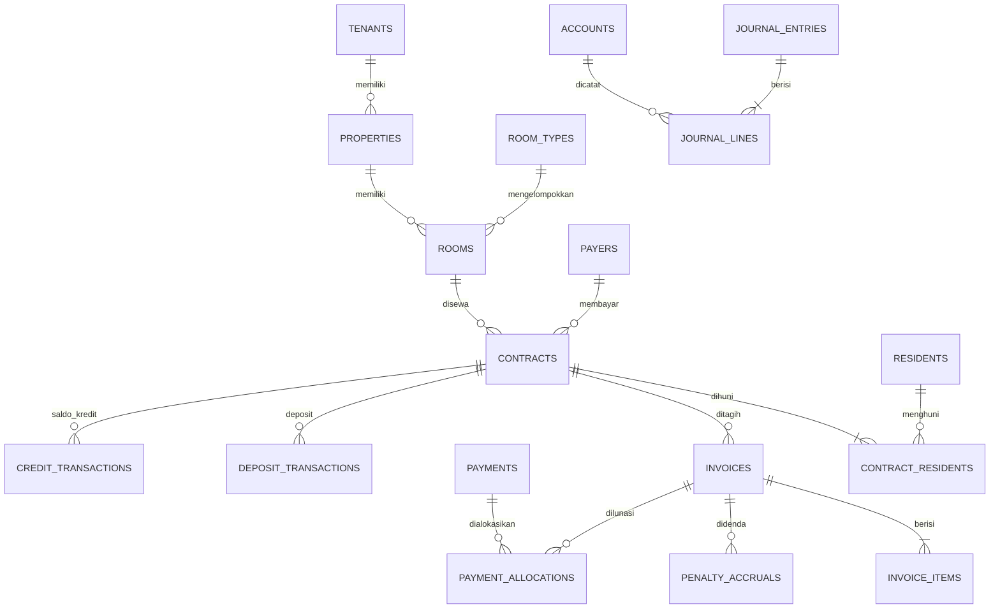

# Skema Database — KostPilot

| Atribut | Nilai |
|---|---|
| Versi | 0.1 (Draft) |
| Tanggal | 25 September 2026 |
| Acuan | [`docs/prd.md`](./prd.md), [`docs/roadmap.md`](./roadmap.md) |
| Database | MySQL 8 (InnoDB, utf8mb4) |

Dokumen ini adalah desain logis database. Migration Laravel ditulis berdasarkan dokumen ini, dan dokumen ini diperbarui setiap kali skema berubah.

---

## Daftar Isi

1. Konvensi
2. Gambaran Relasi Inti
3. Platform
4. Akses & Audit
5. Properti & Kamar
6. Penghuni & Kontrak
7. CRM & Booking
8. Billing
9. Pembayaran
10. Keuangan
11. Maintenance
12. Komunikasi
13. Agent
14. Pola Transaksi & Konkurensi
15. Urutan Migration
16. Keputusan Terbuka

---

## 1. Konvensi

### 1.1 Kolom standar

Kecuali disebutkan lain, **setiap tabel** memiliki:

| Kolom | Tipe | Keterangan |
|---|---|---|
| `id` | `CHAR(26)` | ULID, primary key |
| `created_at` | `TIMESTAMP` | UTC |
| `updated_at` | `TIMESTAMP` | UTC |

Setiap **tabel tenant** (ditandai 🏠 di judul tabel) juga memiliki:

| Kolom | Tipe | Keterangan |
|---|---|---|
| `tenant_id` | `CHAR(26)` | FK `tenants.id`, NOT NULL, diisi otomatis oleh trait `BelongsToTenant` |

Kolom standar tidak ditulis ulang di setiap tabel di bawah.

### 1.2 Primary key: ULID

- ULID dipakai agar ID tidak berurutan dan tidak mudah ditebak (mendukung NFR-ISO-05), tetap dapat diurutkan berdasarkan waktu, dan aman ditampilkan di URL.
- Semua foreign key bertipe `CHAR(26)`.

### 1.3 Uang

- Semua nominal bertipe `BIGINT` dalam **rupiah utuh**, akhiran kolom `_amount`.
- Nominal yang tidak mungkin negatif diberi `CHECK (… >= 0)`.
- Persentase bertipe `DECIMAL(5,2)` (contoh: `2.50` = 2,5%).
- Tidak ada kolom `FLOAT` atau `DOUBLE` untuk uang.

### 1.4 Tanggal dan waktu

- `DATE` untuk tanggal bisnis (jatuh tempo, periode sewa, tanggal masuk). Tanggal bisnis dimaknai dalam zona waktu properti.
- `TIMESTAMP` untuk kejadian sistem, selalu UTC.

### 1.5 Status dan enum

- Status disimpan sebagai `VARCHAR(32)` dengan nilai yang dijaga di aplikasi (state machine) dan `CHECK` constraint.
- Nilai yang diizinkan ditulis di kolom Keterangan.

### 1.6 Indeks

- Setiap indeks di tabel tenant **diawali `tenant_id`**.
- Setiap unique constraint bisnis menyertakan `tenant_id` (misal nomor tagihan unik per tenant).

### 1.7 Penghapusan

| Jenis data | Kebijakan |
|---|---|
| Data master (properti, kamar, penghuni, vendor) | Soft delete (`deleted_at`) |
| Dokumen keuangan (tagihan, pembayaran, jurnal, deposit) | **Tidak pernah dihapus**; koreksi lewat void, credit note, atau pembalikan (PRD §8.10) |
| Log (audit, webhook, notifikasi, agent) | Tidak dihapus; diarsip sesuai kebijakan retensi |

### 1.8 Foreign key

- Default `ON DELETE RESTRICT`.
- `ON DELETE CASCADE` hanya untuk tabel anak yang tidak bermakna tanpa induknya dan bukan data keuangan (misal `ticket_updates`).

### 1.9 Data terenkripsi

- Kolom bertanda 🔒 dienkripsi di tingkat aplikasi (cast `encrypted` Laravel), bertipe `TEXT`.
- Kolom terenkripsi tidak dapat dicari langsung; jika perlu pencarian atau deteksi duplikat, disediakan kolom `…_hash` berisi HMAC-SHA256 dengan kunci terpisah.

### 1.10 Nomor telepon

Disimpan dalam format E.164 (`+628…`) di kolom `VARCHAR(20)`.

### 1.11 Label fase

Setiap tabel diberi label fase sesuai PRD: **P0**, **P1**, **P2**, atau **F3**. Tabel hanya dibuat saat fasenya dikerjakan.

---

## 2. Gambaran Relasi Inti

Diagram hanya memuat relasi utama alur sewa–tagihan–pembayaran–jurnal.



---

## 3. Platform

Tabel di bagian ini **bukan** tabel tenant, kecuali ditandai 🏠.

### 3.1 `tenants` — P0

| Kolom | Tipe | Keterangan |
|---|---|---|
| `name` | `VARCHAR(150)` | Nama usaha |
| `slug` | `VARCHAR(80)` | Unik; dipakai untuk subdomain/URL portal |
| `logo_path` | `VARCHAR(255)` NULL | Branding (FR-SUB-07) |
| `brand_color` | `VARCHAR(7)` NULL | Warna aksen hex |
| `default_timezone` | `VARCHAR(40)` | Default `Asia/Jakarta` |
| `trial_ends_at` | `TIMESTAMP` NULL | |
| `frozen_at` | `TIMESTAMP` NULL | Diisi saat dibekukan (FR-TNT-06) |
| `settings` | `JSON` | Pengaturan tingkat tenant yang jarang dicari |

Indeks: `UNIQUE(slug)`.

### 3.2 `plans` — P1

| Kolom | Tipe | Keterangan |
|---|---|---|
| `code` | `VARCHAR(40)` | Unik |
| `name` | `VARCHAR(80)` | |
| `monthly_price_amount` | `BIGINT` | |
| `yearly_price_amount` | `BIGINT` NULL | |
| `max_rooms` | `INT` NULL | NULL = tanpa batas |
| `max_properties` | `INT` NULL | |
| `max_staff` | `INT` NULL | |
| `monthly_message_quota` | `INT` NULL | |
| `monthly_ai_credit_quota` | `INT` NULL | |
| `features` | `JSON` | Feature flag (FR-SUB-02) |
| `is_active` | `BOOLEAN` | |
| `sort_order` | `SMALLINT` | |

### 3.3 `subscriptions` 🏠 — P1

| Kolom | Tipe | Keterangan |
|---|---|---|
| `plan_id` | `CHAR(26)` | FK `plans` |
| `status` | `VARCHAR(32)` | `trial`, `active`, `grace`, `read_only`, `frozen`, `cancelled` (PRD §9.6) |
| `billing_cycle` | `VARCHAR(16)` | `monthly`, `yearly` |
| `current_period_start` | `DATE` | |
| `current_period_end` | `DATE` | |
| `grace_ends_at` | `TIMESTAMP` NULL | |
| `cancelled_at` | `TIMESTAMP` NULL | |

Indeks: `UNIQUE(tenant_id)` — satu langganan aktif per tenant.

### 3.4 `subscription_invoices` 🏠 — P1

| Kolom | Tipe | Keterangan |
|---|---|---|
| `subscription_id` | `CHAR(26)` | FK |
| `number` | `VARCHAR(40)` | Unik global |
| `amount` | `BIGINT` | |
| `status` | `VARCHAR(32)` | `unpaid`, `paid`, `void` |
| `due_date` | `DATE` | |
| `paid_at` | `TIMESTAMP` NULL | |
| `gateway_reference` | `VARCHAR(100)` NULL | |

### 3.5 `platform_admins` — P0

| Kolom | Tipe | Keterangan |
|---|---|---|
| `name` | `VARCHAR(100)` | |
| `email` | `VARCHAR(150)` | Unik |
| `password` | `VARCHAR(255)` | Hash |
| `two_factor_secret` 🔒 | `TEXT` NULL | Wajib aktif (NFR-SEC-05) |
| `two_factor_confirmed_at` | `TIMESTAMP` NULL | |

### 3.6 `impersonation_logs` — P0

| Kolom | Tipe | Keterangan |
|---|---|---|
| `platform_admin_id` | `CHAR(26)` | FK |
| `tenant_id` | `CHAR(26)` | FK |
| `reason` | `TEXT` | Wajib (FR-TNT-05) |
| `started_at` | `TIMESTAMP` | |
| `ended_at` | `TIMESTAMP` NULL | |
| `ip_address` | `VARCHAR(45)` | |

Tidak memiliki `updated_at` selain untuk mengisi `ended_at`.

### 3.7 `document_sequences` 🏠 — P0

Penomoran dokumen per tenant (FR-BIL-07).

| Kolom | Tipe | Keterangan |
|---|---|---|
| `document_type` | `VARCHAR(32)` | `invoice`, `receipt`, `credit_note`, `contract`, `journal` |
| `format` | `VARCHAR(80)` | Contoh `INV/{YYYY}/{MM}/{SEQ:5}` |
| `reset_period` | `VARCHAR(16)` | `never`, `yearly`, `monthly` |
| `current_period_key` | `VARCHAR(10)` | Contoh `2026-09` |
| `next_number` | `INT UNSIGNED` | |

Indeks: `UNIQUE(tenant_id, document_type)`. Diambil dengan `SELECT … FOR UPDATE` (§14.3).

---

## 4. Akses & Audit

### 4.1 `users` 🏠 — P0

Staf dan owner. Penghuni **tidak** disimpan di sini (lihat §6.1).

| Kolom | Tipe | Keterangan |
|---|---|---|
| `name` | `VARCHAR(100)` | |
| `email` | `VARCHAR(150)` | Unik global; satu user terikat ke satu tenant |
| `phone` | `VARCHAR(20)` NULL | E.164 |
| `password` | `VARCHAR(255)` | Hash |
| `two_factor_secret` 🔒 | `TEXT` NULL | |
| `two_factor_confirmed_at` | `TIMESTAMP` NULL | |
| `is_active` | `BOOLEAN` | |
| `last_login_at` | `TIMESTAMP` NULL | |
| `deleted_at` | `TIMESTAMP` NULL | Soft delete |

Indeks: `UNIQUE(email)`, `INDEX(tenant_id, is_active)`.

### 4.2 Role & permission — P0

Memakai tabel bawaan `spatie/laravel-permission` dengan fitur **teams**, di mana `team_id` = `tenant_id`. Peran bawaan dibuat per tenant saat registrasi. Tabel: `roles`, `permissions`, `model_has_roles`, `model_has_permissions`, `role_has_permissions`.

### 4.3 `property_user` 🏠 — P0

Penugasan staf ke properti (FR-USR-02).

| Kolom | Tipe | Keterangan |
|---|---|---|
| `property_id` | `CHAR(26)` | FK |
| `user_id` | `CHAR(26)` | FK |

Indeks: `UNIQUE(tenant_id, property_id, user_id)`. Tanpa `updated_at`.

### 4.4 `audit_logs` 🏠 — P0

| Kolom | Tipe | Keterangan |
|---|---|---|
| `actor_type` | `VARCHAR(32)` | `user`, `resident`, `system`, `agent`, `platform_admin` |
| `actor_id` | `CHAR(26)` NULL | NULL untuk `system` |
| `event` | `VARCHAR(80)` | Contoh `invoice.voided`, `penalty.waived` |
| `subject_type` | `VARCHAR(80)` | Nama model |
| `subject_id` | `CHAR(26)` | |
| `old_values` | `JSON` NULL | |
| `new_values` | `JSON` NULL | |
| `reason` | `TEXT` NULL | Untuk aksi yang wajib alasan |
| `ip_address` | `VARCHAR(45)` NULL | |
| `impersonation_log_id` | `CHAR(26)` NULL | Terisi jika aksi dilakukan saat impersonasi |

Hanya `created_at`. Indeks: `INDEX(tenant_id, subject_type, subject_id)`, `INDEX(tenant_id, created_at)`.

### 4.5 `otp_codes` 🏠 — P1

Login portal penghuni dan pembayar (FR-PRT-01).

| Kolom | Tipe | Keterangan |
|---|---|---|
| `phone` | `VARCHAR(20)` | |
| `purpose` | `VARCHAR(32)` | `portal_login` |
| `code_hash` | `VARCHAR(255)` | Kode tidak disimpan mentah |
| `attempts` | `TINYINT UNSIGNED` | Dibatasi (NFR-SEC-03) |
| `expires_at` | `TIMESTAMP` | |
| `consumed_at` | `TIMESTAMP` NULL | |

Indeks: `INDEX(tenant_id, phone, purpose)`.

### 4.6 `attachments` 🏠 — P0

Semua berkas (foto kamar, bukti transfer, dokumen identitas, foto meteran, foto sebelum/sesudah perbaikan).

| Kolom | Tipe | Keterangan |
|---|---|---|
| `attachable_type` | `VARCHAR(80)` | Polymorphic |
| `attachable_id` | `CHAR(26)` | |
| `collection` | `VARCHAR(32)` | `photo`, `payment_proof`, `identity`, `meter`, `before`, `after`, `document`, `inspection` |
| `disk` | `VARCHAR(32)` | |
| `path` | `VARCHAR(255)` | Selalu di bawah `tenants/{tenant_id}/` (NFR-ISO-03) |
| `original_name` | `VARCHAR(255)` | |
| `mime_type` | `VARCHAR(100)` | |
| `size_bytes` | `INT UNSIGNED` | |
| `is_encrypted` | `BOOLEAN` | `true` untuk koleksi `identity` |
| `uploaded_by_type` | `VARCHAR(32)` | Sama seperti `actor_type` |
| `uploaded_by_id` | `CHAR(26)` NULL | |

Indeks: `INDEX(tenant_id, attachable_type, attachable_id, collection)`.

---

## 5. Properti & Kamar

### 5.1 `properties` 🏠 — P0

| Kolom | Tipe | Keterangan |
|---|---|---|
| `name` | `VARCHAR(150)` | |
| `code` | `VARCHAR(20)` | Kode singkat, unik per tenant |
| `address` | `TEXT` | |
| `city` | `VARCHAR(80)` | |
| `province` | `VARCHAR(80)` | |
| `postal_code` | `VARCHAR(10)` NULL | |
| `timezone` | `VARCHAR(40)` | `Asia/Jakarta`, `Asia/Makassar`, `Asia/Jayapura` (NFR-LOC-02) |
| `gender_policy` | `VARCHAR(16)` | `male`, `female`, `mixed` |
| `rules` | `TEXT` NULL | Aturan kost |
| `facilities` | `JSON` NULL | Fasilitas umum |
| `deleted_at` | `TIMESTAMP` NULL | |

Indeks: `UNIQUE(tenant_id, code)`.

### 5.2 `property_settings` 🏠 — P0

Satu baris per properti (FR-PRP-04). Dipisah dari `properties` agar perubahan aturan tercatat jelas di audit log.

| Kolom | Tipe | Keterangan |
|---|---|---|
| `property_id` | `CHAR(26)` | FK, unik |
| `billing_mode` | `VARCHAR(16)` | `anniversary` (default), `fixed_date` (PRD §8.2) |
| `fixed_billing_day` | `TINYINT UNSIGNED` NULL | 1–28, wajib jika `fixed_date` |
| `invoice_lead_days` | `TINYINT UNSIGNED` | Default 7 |
| `proration_basis` | `VARCHAR(16)` | `actual_days` (default), `thirty_days` (PRD §8.3) |
| `grace_days` | `TINYINT UNSIGNED` | Default 3 (PRD §8.4) |
| `penalty_type` | `VARCHAR(16)` | `none`, `flat`, `daily`, `percent` |
| `penalty_amount` | `BIGINT` NULL | Untuk `flat` dan `daily` |
| `penalty_percent` | `DECIMAL(5,2)` NULL | Untuk `percent` |
| `penalty_max_amount` | `BIGINT` NULL | Batas per tagihan |
| `allocation_order` | `JSON` | Default `["rent","utility","addon","other","penalty"]` (PRD §8.5) |
| `notice_days` | `SMALLINT UNSIGNED` | Default 30 (PRD §8.9) |
| `booking_hold_hours` | `SMALLINT UNSIGNED` | Default 24 (PRD §8.7) |
| `cancellation_policy` | `JSON` | Aturan pengembalian DP per rentang hari |
| `rounding_unit` | `INT UNSIGNED` | Default 1; contoh 1000 untuk pembulatan ribuan (PRD §8.1) |

Indeks: `UNIQUE(tenant_id, property_id)`.

### 5.3 `room_types` 🏠 — P0

| Kolom | Tipe | Keterangan |
|---|---|---|
| `property_id` | `CHAR(26)` | FK |
| `name` | `VARCHAR(80)` | |
| `description` | `TEXT` NULL | |
| `default_capacity` | `TINYINT UNSIGNED` | Default 1 |
| `facilities` | `JSON` NULL | |
| `deleted_at` | `TIMESTAMP` NULL | |

### 5.4 `rooms` 🏠 — P0

| Kolom | Tipe | Keterangan |
|---|---|---|
| `property_id` | `CHAR(26)` | FK |
| `room_type_id` | `CHAR(26)` | FK |
| `number` | `VARCHAR(20)` | Unik per properti |
| `floor` | `VARCHAR(10)` NULL | |
| `capacity` | `TINYINT UNSIGNED` | Default dari tipe |
| `status` | `VARCHAR(32)` | `available`, `held`, `booked`, `occupied`, `vacating`, `maintenance` (PRD §9.1) |
| `facilities` | `JSON` NULL | Tambahan di luar tipe |
| `notes` | `TEXT` NULL | |
| `deleted_at` | `TIMESTAMP` NULL | |

Indeks: `UNIQUE(tenant_id, property_id, number)`, `INDEX(tenant_id, property_id, status)`.

### 5.5 `room_prices` 🏠 — P0

Riwayat harga (FR-KMR-01, FR-KMR-03). Tepat satu dari `room_type_id` atau `room_id` terisi; harga kamar mengalahkan harga tipe.

| Kolom | Tipe | Keterangan |
|---|---|---|
| `room_type_id` | `CHAR(26)` NULL | FK |
| `room_id` | `CHAR(26)` NULL | FK, untuk override |
| `rental_period` | `VARCHAR(16)` | `daily`, `weekly`, `monthly`, `quarterly`, `semiannual`, `yearly` |
| `amount` | `BIGINT` | `CHECK >= 0` |
| `effective_from` | `DATE` | |
| `effective_until` | `DATE` NULL | NULL = masih berlaku |
| `created_by` | `CHAR(26)` | FK `users` |

Constraint: `CHECK ((room_type_id IS NULL) <> (room_id IS NULL))`.
Indeks: `INDEX(tenant_id, room_type_id, rental_period, effective_from)`, `INDEX(tenant_id, room_id, rental_period, effective_from)`.

### 5.6 `bank_accounts` 🏠 — P0

Rekening tujuan pembayaran yang ditampilkan ke penghuni (FR-PRP-03). Setiap baris terhubung ke akun buku besar.

| Kolom | Tipe | Keterangan |
|---|---|---|
| `property_id` | `CHAR(26)` NULL | NULL = dipakai semua properti |
| `kind` | `VARCHAR(16)` | `bank`, `ewallet` |
| `provider_name` | `VARCHAR(80)` | Nama bank atau e-wallet |
| `account_number` | `VARCHAR(40)` | |
| `account_holder` | `VARCHAR(100)` | |
| `ledger_account_id` | `CHAR(26)` | FK `accounts` |
| `is_default` | `BOOLEAN` | |
| `is_active` | `BOOLEAN` | |

### 5.7 `assets` 🏠 — P1

| Kolom | Tipe | Keterangan |
|---|---|---|
| `property_id` | `CHAR(26)` | FK |
| `room_id` | `CHAR(26)` NULL | NULL = area umum |
| `code` | `VARCHAR(30)` | Unik per tenant |
| `name` | `VARCHAR(100)` | |
| `category` | `VARCHAR(40)` | |
| `condition` | `VARCHAR(16)` | `good`, `fair`, `poor`, `broken` |
| `acquired_on` | `DATE` NULL | |
| `acquisition_amount` | `BIGINT` NULL | |
| `notes` | `TEXT` NULL | |
| `deleted_at` | `TIMESTAMP` NULL | |

---

## 6. Penghuni & Kontrak

### 6.1 `residents` 🏠 — P0

Penghuni juga menjadi entitas autentikasi portal (guard `resident`, login OTP).

| Kolom | Tipe | Keterangan |
|---|---|---|
| `full_name` | `VARCHAR(150)` | |
| `phone` | `VARCHAR(20)` | E.164 |
| `email` | `VARCHAR(150)` NULL | |
| `gender` | `VARCHAR(8)` NULL | `male`, `female`; hanya untuk validasi kost putra/putri (FR-BKG-04) |
| `birth_date` | `DATE` NULL | |
| `identity_type` | `VARCHAR(16)` NULL | `ktp`, `sim`, `passport`, `student_card`, `other` |
| `identity_number` 🔒 | `TEXT` NULL | NFR-SEC-01 |
| `identity_number_hash` | `CHAR(64)` NULL | HMAC untuk deteksi duplikat |
| `institution` | `VARCHAR(150)` NULL | Kampus atau kantor |
| `emergency_contact_name` | `VARCHAR(100)` NULL | |
| `emergency_contact_phone` | `VARCHAR(20)` NULL | |
| `emergency_contact_relation` | `VARCHAR(40)` NULL | |
| `vehicle_plate` | `VARCHAR(20)` NULL | |
| `internal_notes` | `TEXT` NULL | Tidak terlihat oleh penghuni (FR-PNH-06) |
| `is_flagged` | `BOOLEAN` | Penanda "tidak disarankan", hanya dalam tenant ini |
| `anonymized_at` | `TIMESTAMP` NULL | Diisi saat dianonimkan (NFR-PDP-02) |
| `deleted_at` | `TIMESTAMP` NULL | |

Indeks: `INDEX(tenant_id, phone)`, `INDEX(tenant_id, identity_number_hash)`.

Anonimisasi mengosongkan kolom identitas, kontak, dan catatan, serta mengganti `full_name` dengan penanda anonim, tanpa menghapus baris agar relasi keuangan tetap utuh.

### 6.2 `payers` 🏠 — P0

Pihak yang ditagih (FR-PNH-03). Jika penghuni membayar sendiri, `resident_id` terisi dan `relation` = `self`.

| Kolom | Tipe | Keterangan |
|---|---|---|
| `resident_id` | `CHAR(26)` NULL | FK, terisi jika pembayar adalah penghuni |
| `name` | `VARCHAR(150)` | |
| `phone` | `VARCHAR(20)` | |
| `email` | `VARCHAR(150)` NULL | |
| `relation` | `VARCHAR(16)` | `self`, `parent`, `guardian`, `company`, `other` |
| `anonymized_at` | `TIMESTAMP` NULL | |

Indeks: `INDEX(tenant_id, phone)`.

### 6.3 `contracts` 🏠 — P0

| Kolom | Tipe | Keterangan |
|---|---|---|
| `property_id` | `CHAR(26)` | FK, denormalisasi untuk filter |
| `room_id` | `CHAR(26)` | FK |
| `payer_id` | `CHAR(26)` | FK |
| `number` | `VARCHAR(40)` | Dari `document_sequences` |
| `status` | `VARCHAR(32)` | `draft`, `active`, `notice`, `completed`, `terminated` (PRD §9.3) |
| `rental_period` | `VARCHAR(16)` | Sama seperti `room_prices` |
| `rent_amount` | `BIGINT` | Harga terkunci per periode |
| `deposit_amount` | `BIGINT` | Deposit yang disepakati |
| `start_date` | `DATE` | |
| `end_date` | `DATE` NULL | NULL = berjalan sampai diakhiri |
| `billing_anchor_day` | `TINYINT UNSIGNED` | Hari acuan jatuh tempo (1–31) |
| `next_period_start` | `DATE` | Awal periode yang akan ditagih berikutnya |
| `split_billing` | `BOOLEAN` | `true` = tagihan terpisah per penghuni (FR-KTR-02) |
| `notify_resident` | `BOOLEAN` | FR-PNH-04 |
| `notify_payer` | `BOOLEAN` | |
| `early_termination_penalty_amount` | `BIGINT` NULL | FR-KTR-04 |
| `notice_given_on` | `DATE` NULL | |
| `planned_move_out_on` | `DATE` NULL | |
| `ended_on` | `DATE` NULL | Tanggal efektif selesai atau diputus |
| `termination_reason` | `TEXT` NULL | |
| `renewed_from_contract_id` | `CHAR(26)` NULL | FK `contracts`, untuk perpanjangan |
| `clauses` | `TEXT` NULL | |
| `created_by` | `CHAR(26)` | FK `users` |
| `imported_at` | `TIMESTAMP` NULL | Terisi untuk kontrak yang sudah berjalan sebelum memakai KostPilot dan diimpor saat onboarding (FR-ONB-02). Deposit-nya masuk lewat saldo awal, tidak ditagih |

Indeks: `UNIQUE(tenant_id, number)`, `INDEX(tenant_id, status, next_period_start)`, `INDEX(tenant_id, room_id, status)`.

### 6.4 `contract_residents` 🏠 — P0

| Kolom | Tipe | Keterangan |
|---|---|---|
| `contract_id` | `CHAR(26)` | FK |
| `resident_id` | `CHAR(26)` | FK |
| `is_primary` | `BOOLEAN` | |
| `share_type` | `VARCHAR(16)` NULL | `equal`, `fixed`; dipakai jika `split_billing` |
| `share_amount` | `BIGINT` NULL | Untuk `fixed` |
| `joined_on` | `DATE` | |
| `left_on` | `DATE` NULL | |

Indeks: `UNIQUE(tenant_id, contract_id, resident_id)`.

### 6.5 `contract_holds` 🏠 — P0

Tarif khusus saat libur panjang (FR-KTR-05).

| Kolom | Tipe | Keterangan |
|---|---|---|
| `contract_id` | `CHAR(26)` | FK |
| `start_date` | `DATE` | |
| `end_date` | `DATE` | |
| `rent_amount` | `BIGINT` | Tarif per periode selama hold |
| `reason` | `TEXT` NULL | |
| `created_by` | `CHAR(26)` | |

### 6.6 `room_moves` 🏠 — P0

Riwayat pindah kamar (FR-SIK-02, PRD §8.8). `contracts.room_id` selalu menunjuk kamar saat ini.

| Kolom | Tipe | Keterangan |
|---|---|---|
| `contract_id` | `CHAR(26)` | FK |
| `from_room_id` | `CHAR(26)` | FK |
| `to_room_id` | `CHAR(26)` | FK |
| `moved_on` | `DATE` | |
| `old_rent_amount` | `BIGINT` | |
| `new_rent_amount` | `BIGINT` | |
| `deposit_difference_amount` | `BIGINT` | Boleh negatif |
| `invoice_id` | `CHAR(26)` NULL | Tagihan prorata kamar baru, bertipe `adhoc` |
| `notes` | `TEXT` NULL | |
| `created_by` | `CHAR(26)` | |

Indeks: `INDEX(tenant_id, contract_id, moved_on)`, `INDEX(tenant_id, to_room_id)`.

Satu pindah kamar bisa mengkredit lebih dari satu tagihan (periode tempat tanggal pindah jatuh, dan periode berikutnya yang sudah terbit), jadi nota kreditnya menunjuk balik lewat `credit_notes.room_move_id`. Urutannya: periode yang dimulai sampai tanggal pindah ditagih dulu dengan kamar lama; sewa kamar lama mulai tanggal pindah dikredit (bila sudah dibayar menjadi saldo kredit); kamar baru ditagih prorata untuk hari yang sama, ditambah selisih deposit bila lebih besar dan meteran terakhir kamar lama. Deposit kamar baru yang lebih kecil tidak dikembalikan otomatis; kelebihannya tetap dipegang sampai check-out atau refund. Meteran kamar baru dihitung dari tanggal pindah.

### 6.7 `inspections` 🏠 — P0

| Kolom | Tipe | Keterangan |
|---|---|---|
| `contract_id` | `CHAR(26)` | FK |
| `room_id` | `CHAR(26)` | FK |
| `type` | `VARCHAR(16)` | `check_in`, `check_out` |
| `inspected_on` | `DATE` | |
| `inspector_id` | `CHAR(26)` | FK `users` |
| `resident_acknowledged_at` | `TIMESTAMP` NULL | FR-SIK-01 |
| `notes` | `TEXT` NULL | |

Indeks: `UNIQUE(tenant_id, contract_id, type)`: satu check-in dan satu check-out per kontrak. Foto di `attachments` dengan `collection = 'inspection'`.

### 6.8 `inspection_items` 🏠 — P0

| Kolom | Tipe | Keterangan |
|---|---|---|
| `inspection_id` | `CHAR(26)` | FK, cascade |
| `asset_id` | `CHAR(26)` NULL | FK, jika terkait aset |
| `item_name` | `VARCHAR(100)` | |
| `condition` | `VARCHAR(16)` | `good`, `fair`, `damaged`, `missing` |
| `charge_amount` | `BIGINT` | Default 0; biaya kerusakan |
| `notes` | `TEXT` NULL | |
| `sort_order` | `SMALLINT` | Urutan di checklist |

### 6.9 `settlements` 🏠 — P0

Penyelesaian akhir check-out (FR-SIK-05, PRD §8.9).

| Kolom | Tipe | Keterangan |
|---|---|---|
| `contract_id` | `CHAR(26)` | FK, unik |
| `inspection_id` | `CHAR(26)` | FK `inspections`, pemeriksaan check-out |
| `status` | `VARCHAR(16)` | `draft`, `finalized` |
| `moved_out_on` | `DATE` | Tanggal penghuni keluar |
| `room_after` | `VARCHAR(16)` | `available`, `maintenance` (PRD §8.9) |
| `outstanding_amount` | `BIGINT` | Tunggakan termasuk denda |
| `damage_amount` | `BIGINT` | Dari `inspection_items` |
| `early_termination_amount` | `BIGINT` | |
| `deposit_balance_amount` | `BIGINT` | Saldo deposit saat penyelesaian |
| `credit_balance_amount` | `BIGINT` | Saldo kredit saat penyelesaian |
| `result_amount` | `BIGINT` | Positif = ditagih, negatif = dikembalikan |
| `final_invoice_id` | `CHAR(26)` NULL | Tagihan `final_settlement`: kerusakan, penalti, meteran terakhir |
| `refund_account_id` | `CHAR(26)` NULL | FK `accounts`; asal pengembalian bila ada |
| `finalized_by` | `CHAR(26)` NULL | |
| `finalized_at` | `TIMESTAMP` NULL | |

Draf dibuat saat check-out dicatat, dengan angka perkiraan. Saat difinalkan owner, dalam satu transaksi: sewa ditagih sampai hari terakhir sewa (rencana keluar, tanggal putus, atau tanggal selesai kontrak); deposit yang ditagih tapi belum dibayar dikredit; tagihan akhir terbit; saldo kredit lalu deposit melunasi tagihan terbuka mulai yang tertua; sisa deposit dan saldo kredit dikembalikan dari `refund_account_id`; yang masih kurang tetap di tagihan terbuka. Angka akhir dihitung ulang saat itu. Kontrak `notice` atau `active` menjadi `completed`; kontrak `terminated` tetap. `deposit_transactions.settlement_id` mendapat foreign key di migration tabel ini.

---

## 7. CRM & Booking

### 7.1 `leads` 🏠 — P1

| Kolom | Tipe | Keterangan |
|---|---|---|
| `property_id` | `CHAR(26)` NULL | |
| `name` | `VARCHAR(150)` | |
| `phone` | `VARCHAR(20)` | |
| `source` | `VARCHAR(32)` | `whatsapp`, `instagram`, `marketplace`, `walk_in`, `referral`, `other` |
| `status` | `VARCHAR(32)` | `new`, `contacted`, `survey_scheduled`, `negotiating`, `booked`, `lost` |
| `lost_reason` | `TEXT` NULL | |
| `desired_room_type_id` | `CHAR(26)` NULL | |
| `desired_move_in` | `DATE` NULL | |
| `budget_amount` | `BIGINT` NULL | |
| `assigned_user_id` | `CHAR(26)` NULL | |
| `notes` | `TEXT` NULL | |

Indeks: `INDEX(tenant_id, status)`, `INDEX(tenant_id, phone)`.

### 7.2 `lead_activities` 🏠 — P1

| Kolom | Tipe | Keterangan |
|---|---|---|
| `lead_id` | `CHAR(26)` | FK, cascade |
| `type` | `VARCHAR(16)` | `note`, `call`, `message`, `survey` |
| `scheduled_at` | `TIMESTAMP` NULL | |
| `done_at` | `TIMESTAMP` NULL | |
| `notes` | `TEXT` NULL | |
| `created_by_type` | `VARCHAR(32)` | |
| `created_by_id` | `CHAR(26)` NULL | |

### 7.3 `bookings` 🏠 — P1

| Kolom | Tipe | Keterangan |
|---|---|---|
| `room_id` | `CHAR(26)` | FK |
| `lead_id` | `CHAR(26)` NULL | |
| `resident_id` | `CHAR(26)` NULL | |
| `status` | `VARCHAR(32)` | `hold`, `confirmed`, `converted`, `expired`, `cancelled` (PRD §9.2) |
| `start_date` | `DATE` | |
| `end_date` | `DATE` NULL | |
| `hold_expires_at` | `TIMESTAMP` NULL | |
| `down_payment_amount` | `BIGINT` | Default 0 |
| `refund_amount` | `BIGINT` NULL | Hasil kebijakan pembatalan |
| `cancelled_at` | `TIMESTAMP` NULL | |
| `cancellation_reason` | `TEXT` NULL | |
| `contract_id` | `CHAR(26)` NULL | Terisi saat dikonversi |
| `created_by_type` | `VARCHAR(32)` | `user`, `agent` |
| `created_by_id` | `CHAR(26)` NULL | |

Indeks: `INDEX(tenant_id, room_id, status, start_date)`, `INDEX(tenant_id, status, hold_expires_at)`.

Pencegahan tumpang tindih dijelaskan di §14.2.

### 7.4 `waitlists` 🏠 — P1

| Kolom | Tipe | Keterangan |
|---|---|---|
| `room_type_id` | `CHAR(26)` | FK |
| `lead_id` | `CHAR(26)` | FK |
| `requested_from` | `DATE` | |
| `notified_at` | `TIMESTAMP` NULL | |

---

## 8. Billing

### 8.1 `invoices` 🏠 — P0

| Kolom | Tipe | Keterangan |
|---|---|---|
| `property_id` | `CHAR(26)` | FK |
| `contract_id` | `CHAR(26)` NULL | NULL hanya untuk tagihan ad-hoc tanpa kontrak |
| `resident_id` | `CHAR(26)` NULL | Terisi jika kontrak `split_billing` |
| `payer_id` | `CHAR(26)` | FK; penerima tagihan |
| `number` | `VARCHAR(40)` NULL | Terisi saat terbit |
| `type` | `VARCHAR(16)` | `rent`, `adhoc`, `final_settlement`, `opening` |
| `status` | `VARCHAR(16)` | `draft`, `issued`, `partial`, `paid`, `void` (PRD §9.4) |
| `generation_key` | `VARCHAR(120)` NULL | Kunci idempotensi, lihat bawah |
| `period_start` | `DATE` NULL | Periode sewa yang ditagih |
| `period_end` | `DATE` NULL | |
| `issue_date` | `DATE` NULL | |
| `due_date` | `DATE` | |
| `items_total_amount` | `BIGINT` | Jumlah `invoice_items.amount` (boleh berisi diskon negatif) |
| `penalty_amount` | `BIGINT` | Jumlah denda aktif dari `penalty_accruals`, default 0 |
| `paid_amount` | `BIGINT` | Jumlah alokasi pembayaran dan saldo kredit, default 0 |
| `credited_amount` | `BIGINT` | Jumlah `credit_notes`, default 0 |
| `balance_amount` | `BIGINT` | **Generated stored:** `items_total_amount + penalty_amount - paid_amount - credited_amount` |
| `voided_at` | `TIMESTAMP` NULL | |
| `void_reason` | `TEXT` NULL | |
| `issued_by_type` | `VARCHAR(32)` NULL | `user`, `system` |
| `issued_by_id` | `CHAR(26)` NULL | |

Indeks:

- `UNIQUE(tenant_id, number)`
- `UNIQUE(tenant_id, generation_key)` — mencegah tagihan sewa terbit ganda untuk periode yang sama. Format: `rent:{contract_id}:{resident_id|all}:{period_start}`.
- `INDEX(tenant_id, status, due_date)` — untuk job denda dan daftar tunggakan
- `INDEX(tenant_id, contract_id, period_start)`
- `INDEX(tenant_id, payer_id, status)`

Aturan: setelah `status` bukan `draft`, hanya kolom `status`, `penalty_amount`, `paid_amount`, `credited_amount`, `voided_at`, dan `void_reason` yang boleh berubah, dan hanya lewat Action (PRD §8.10). Status "telat" tidak disimpan; dihitung dari `due_date < hari ini` dan `balance_amount > 0`.

### 8.2 `invoice_items` 🏠 — P0

| Kolom | Tipe | Keterangan |
|---|---|---|
| `invoice_id` | `CHAR(26)` | FK |
| `type` | `VARCHAR(16)` | `rent`, `utility`, `deposit`, `addon`, `damage`, `discount`, `rounding`, `other` |
| `allocation_category` | `VARCHAR(16)` | `deposit`, `rent`, `utility`, `addon`, `other` — dipakai urutan alokasi |
| `description` | `VARCHAR(255)` | |
| `quantity` | `DECIMAL(12,3)` | Default 1 |
| `unit_amount` | `BIGINT` | |
| `amount` | `BIGINT` | `quantity × unit_amount` setelah pembulatan; negatif untuk diskon |
| `period_start` | `DATE` NULL | Untuk prorata |
| `period_end` | `DATE` NULL | |
| `source_type` | `VARCHAR(80)` NULL | Polymorphic: `meter_readings`, `tickets`, `inspection_items`, `addon_usages` |
| `source_id` | `CHAR(26)` NULL | |
| `sort_order` | `SMALLINT` | |

Indeks: `INDEX(tenant_id, invoice_id)`, `INDEX(tenant_id, source_type, source_id)`.

Tidak dapat diubah setelah tagihan terbit.

### 8.3 `penalty_accruals` 🏠 — P0

Denda dicatat terpisah dari item tagihan agar tagihan terbit tetap tidak berubah (PRD §8.4).

| Kolom | Tipe | Keterangan |
|---|---|---|
| `invoice_id` | `CHAR(26)` | FK |
| `accrued_on` | `DATE` | Tanggal denda dihitung (zona waktu properti) |
| `amount` | `BIGINT` | `CHECK > 0` |
| `rule_snapshot` | `JSON` | Salinan aturan denda saat dihitung |
| `waived_at` | `TIMESTAMP` NULL | |
| `waived_by` | `CHAR(26)` NULL | |
| `waive_reason` | `TEXT` NULL | Wajib jika di-waive |

Indeks: `UNIQUE(tenant_id, invoice_id, accrued_on)` — job denda aman dijalankan ulang.

`invoices.penalty_amount` = jumlah `amount` yang `waived_at IS NULL`, diperbarui dalam transaksi yang sama.

### 8.4 `credit_notes` 🏠 — P0

| Kolom | Tipe | Keterangan |
|---|---|---|
| `invoice_id` | `CHAR(26)` | FK |
| `number` | `VARCHAR(40)` | Dari `document_sequences` |
| `allocation_category` | `VARCHAR(16)` | Komponen yang dikurangi |
| `amount` | `BIGINT` | `CHECK > 0` |
| `reason` | `TEXT` | Wajib |
| `issued_on` | `DATE` | |
| `created_by` | `CHAR(26)` | |
| `room_move_id` | `CHAR(26)` NULL | FK `room_moves`; nota kredit sisa sewa kamar lama (PRD §8.8) |

Indeks: `UNIQUE(tenant_id, number)`, `INDEX(tenant_id, invoice_id)`.

### 8.5 `utility_rates` 🏠 — P0

| Kolom | Tipe | Keterangan |
|---|---|---|
| `property_id` | `CHAR(26)` | FK |
| `utility` | `VARCHAR(16)` | `electricity`, `water`, `internet`, `other` |
| `mode` | `VARCHAR(16)` | `metered`, `token`, `flat` (FR-UTL-01) |
| `unit` | `VARCHAR(8)` NULL | `kwh`, `m3` untuk `metered` |
| `rate_amount` | `BIGINT` | Per unit untuk `metered`, per periode untuk `flat` |
| `effective_from` | `DATE` | |
| `effective_until` | `DATE` NULL | |

### 8.6 `meter_readings` 🏠 — P0

| Kolom | Tipe | Keterangan |
|---|---|---|
| `room_id` | `CHAR(26)` | FK |
| `utility` | `VARCHAR(16)` | |
| `reading_date` | `DATE` | |
| `previous_value` | `DECIMAL(12,2)` | Diambil dari pembacaan sebelumnya |
| `current_value` | `DECIMAL(12,2)` | |
| `usage` | `DECIMAL(12,2)` | **Generated stored:** `current_value - previous_value` |
| `is_meter_replaced` | `BOOLEAN` | Mengizinkan `current_value < previous_value` (FR-UTL-03) |
| `rate_amount` | `BIGINT` | Snapshot tarif |
| `amount` | `BIGINT` | Hasil perhitungan |
| `invoice_item_id` | `CHAR(26)` NULL | Terisi saat masuk tagihan |
| `recorded_by` | `CHAR(26)` | |
| `client_uuid` | `CHAR(36)` NULL | Dari perangkat, untuk input saat koneksi lemah (FR-UTL-05) |

Constraint: `CHECK (is_meter_replaced OR current_value >= previous_value)`.
Indeks: `UNIQUE(tenant_id, room_id, utility, reading_date)`, `UNIQUE(tenant_id, client_uuid)`.

### 8.7 Tabel P2 billing

- `addon_services` 🏠 — katalog layanan tambahan (nama, harga, tipe `subscription`/`usage`).
- `addon_subscriptions` 🏠 — layanan berlangganan per kontrak.
- `addon_usages` 🏠 — pemakaian per kejadian, masuk ke `invoice_items` lewat `source_type`.

Detail kolom ditulis saat Fase 4.

---

## 9. Pembayaran

### 9.1 `payments` 🏠 — P0

| Kolom | Tipe | Keterangan |
|---|---|---|
| `property_id` | `CHAR(26)` | FK |
| `payer_id` | `CHAR(26)` NULL | |
| `contract_id` | `CHAR(26)` NULL | |
| `booking_id` | `CHAR(26)` NULL | Untuk DP booking |
| `receipt_number` | `VARCHAR(40)` NULL | Terisi saat terverifikasi (FR-PAY-06) |
| `method` | `VARCHAR(16)` | `transfer`, `cash`, `gateway` |
| `channel` | `VARCHAR(16)` | `manual`, `portal`, `gateway`, `agent` |
| `status` | `VARCHAR(16)` | `pending`, `verified`, `rejected`, `reversed` |
| `amount` | `BIGINT` | `CHECK > 0` |
| `paid_at` | `TIMESTAMP` | Waktu uang dibayarkan menurut bukti |
| `bank_account_id` | `CHAR(26)` NULL | Rekening tujuan; NULL untuk tunai |
| `received_by_user_id` | `CHAR(26)` NULL | Wajib untuk `cash` (FR-PAY-07) |
| `reference` | `VARCHAR(100)` NULL | Nomor referensi transfer |
| `gateway_transaction_id` | `VARCHAR(100)` NULL | |
| `rejection_reason` | `TEXT` NULL | |
| `verified_by_type` | `VARCHAR(32)` NULL | `user`, `system`, `agent` |
| `verified_by_id` | `CHAR(26)` NULL | |
| `verified_at` | `TIMESTAMP` NULL | |
| `reversed_at` | `TIMESTAMP` NULL | |
| `reversal_reason` | `TEXT` NULL | |

Constraint: `CHECK (method <> 'cash' OR received_by_user_id IS NOT NULL)`.
Indeks: `UNIQUE(tenant_id, receipt_number)`, `UNIQUE(tenant_id, gateway_transaction_id)`, `INDEX(tenant_id, status, created_at)`, `INDEX(tenant_id, payer_id)`.

Bukti transfer disimpan di `attachments` dengan `collection = 'payment_proof'`.

### 9.2 `payment_allocations` 🏠 — P0

Pemetaan pelunasan ke tagihan per komponen (PRD §8.5). Tepat satu dari `payment_id`, `credit_transaction_id`, atau `deposit_transaction_id` terisi.

| Kolom | Tipe | Keterangan |
|---|---|---|
| `payment_id` | `CHAR(26)` NULL | FK |
| `credit_transaction_id` | `CHAR(26)` NULL | FK; pelunasan dari saldo kredit |
| `deposit_transaction_id` | `CHAR(26)` NULL | FK; pelunasan dari deposit atas persetujuan owner (PRD §8.6) |
| `invoice_id` | `CHAR(26)` | FK |
| `allocation_category` | `VARCHAR(16)` | `deposit`, `rent`, `utility`, `addon`, `other`, `penalty` |
| `amount` | `BIGINT` | `CHECK > 0` |
| `reversed_at` | `TIMESTAMP` NULL | Diisi saat alokasi dibatalkan |

Constraint: `CHECK ((payment_id IS NOT NULL) + (credit_transaction_id IS NOT NULL) + (deposit_transaction_id IS NOT NULL) = 1)`.
Indeks: `INDEX(tenant_id, invoice_id)`, `INDEX(tenant_id, payment_id)`, `INDEX(tenant_id, credit_transaction_id)`.

Alokasi tidak pernah diubah atau dihapus. Alokasi dibatalkan (`reversed_at`) saat pembayarannya dibalik, saat saldo kredit yang dipakai ditarik kembali, atau saat nota kredit membuat tagihan lunas terbayar lebih. Bila hanya sebagian yang dilepas, alokasi lama dibatalkan dan sisanya ditulis sebagai alokasi baru dari sumber yang sama. Uang yang dilepas kembali ke asalnya: pembayaran menjadi saldo kredit (`overpayment`), saldo kredit kembali ke saldo kredit (`reversal`), deposit kembali ke deposit (`reversal`).

Setiap pembayaran terverifikasi memenuhi: `amount` = jumlah alokasi aktifnya + jumlah `credit_transactions` dengan `payment_id` pembayaran itu.

### 9.3 `credit_transactions` 🏠 — P0

Ledger saldo kredit per kontrak (FR-PAY-05). Saldo = `SUM(amount)`.

| Kolom | Tipe | Keterangan |
|---|---|---|
| `contract_id` | `CHAR(26)` | FK |
| `type` | `VARCHAR(16)` | `overpayment`, `down_payment`, `room_move_credit`, `applied`, `refunded`, `opening`, `reversal` |
| `amount` | `BIGINT` | Positif menambah saldo, negatif mengurangi |
| `payment_id` | `CHAR(26)` NULL | Sumber kelebihan bayar |
| `booking_id` | `CHAR(26)` NULL | Sumber DP yang dikonversi |
| `invoice_id` | `CHAR(26)` NULL | Tujuan saat `applied`; asal saat saldo dilepas dari tagihan |
| `occurred_on` | `DATE` | |
| `created_by_type` | `VARCHAR(32)` | |
| `created_by_id` | `CHAR(26)` NULL | |

Constraint: `CHECK (amount <> 0)`.
Indeks: `INDEX(tenant_id, contract_id, occurred_on)`, `INDEX(tenant_id, payment_id)`.

Saldo kredit dipakai otomatis saat tagihan kontrak berikutnya terbit, untuk semua tagihan kontrak yang belum lunas mulai dari yang paling lama. Pengelola juga bisa memakainya kapan saja. Saat pembayaran yang meninggalkan saldo kredit dibalik dan saldonya sudah terpakai, pemakaian terbaru ditarik kembali lebih dulu.

### 9.4 `staff_cash_handovers` 🏠 — P0

Setoran kas dari staf (FR-PAY-08, PRD §8.12).

| Kolom | Tipe | Keterangan |
|---|---|---|
| `property_id` | `CHAR(26)` | FK |
| `staff_user_id` | `CHAR(26)` | FK `users` |
| `expected_amount` | `BIGINT` | Saldo akun kas di tangan staf saat setoran |
| `actual_amount` | `BIGINT` | Uang yang benar-benar disetor |
| `difference_amount` | `BIGINT` | **Generated stored:** `actual_amount - expected_amount` |
| `destination_account_id` | `CHAR(26)` | FK `accounts` (kas atau bank owner) |
| `status` | `VARCHAR(16)` | `pending`, `confirmed`, `disputed` |
| `difference_note` | `TEXT` NULL | Wajib jika selisih ≠ 0 saat konfirmasi |
| `dispute_note` | `TEXT` NULL | Diisi owner saat setoran dipersoalkan |
| `handed_over_at` | `TIMESTAMP` | |
| `confirmed_by` | `CHAR(26)` NULL | |
| `confirmed_at` | `TIMESTAMP` NULL | |

Constraint: `CHECK (status <> 'confirmed' OR actual_amount = expected_amount OR difference_note IS NOT NULL)`.
Indeks: `INDEX(tenant_id, staff_user_id, property_id)`, `INDEX(tenant_id, status)`.

Kas di tangan staf per properti = pembayaran tunai terverifikasi yang ia terima dikurangi `expected_amount` semua setorannya. Selisih diselesaikan di setoran itu sendiri, tidak terbawa ke saldo berikutnya. Tunai yang diterima owner langsung masuk akun Kas dan tidak perlu disetor. Status: `pending → confirmed`, `pending → disputed`, `disputed → confirmed`.

### 9.5 `gateway_credentials` 🏠 — P1

| Kolom | Tipe | Keterangan |
|---|---|---|
| `provider` | `VARCHAR(32)` | |
| `environment` | `VARCHAR(16)` | `sandbox`, `production` |
| `credentials` 🔒 | `TEXT` | JSON terenkripsi (NFR-SEC-02) |
| `webhook_secret` 🔒 | `TEXT` NULL | |
| `is_active` | `BOOLEAN` | |

Indeks: `UNIQUE(tenant_id, provider, environment)`.

### 9.6 `gateway_payment_requests` 🏠 — P1

Virtual account atau QRIS yang dibuat untuk tagihan (FR-PAY-09).

| Kolom | Tipe | Keterangan |
|---|---|---|
| `invoice_id` | `CHAR(26)` | FK |
| `provider` | `VARCHAR(32)` | |
| `method` | `VARCHAR(16)` | `va`, `qris` |
| `external_id` | `VARCHAR(100)` | ID di sisi penyedia |
| `amount` | `BIGINT` | |
| `payment_code` | `VARCHAR(100)` NULL | Nomor VA atau string QR |
| `status` | `VARCHAR(16)` | `pending`, `paid`, `expired`, `cancelled` |
| `expires_at` | `TIMESTAMP` NULL | |
| `payment_id` | `CHAR(26)` NULL | Terisi saat lunas |

Indeks: `UNIQUE(provider, external_id)`.

### 9.7 `gateway_webhook_logs` — P1

Bukan tabel tenant karena tenant baru diketahui setelah webhook diverifikasi.

| Kolom | Tipe | Keterangan |
|---|---|---|
| `tenant_id` | `CHAR(26)` NULL | Terisi setelah dicocokkan |
| `provider` | `VARCHAR(32)` | |
| `event_id` | `VARCHAR(150)` | ID unik dari penyedia |
| `event_type` | `VARCHAR(80)` | |
| `payload` | `JSON` | |
| `signature_valid` | `BOOLEAN` | |
| `status` | `VARCHAR(16)` | `received`, `processed`, `ignored`, `failed` |
| `error` | `TEXT` NULL | |
| `processed_at` | `TIMESTAMP` NULL | |

Indeks: `UNIQUE(provider, event_id)` — kunci idempotensi (FR-PAY-10).

---

## 10. Keuangan

### 10.1 `accounts` 🏠 — P0

Bagan akun (FR-ACC-01). Akun sistem dibuat otomatis saat registrasi tenant; daftar lengkap akan ditulis di `docs/chart-of-accounts.md`.

| Kolom | Tipe | Keterangan |
|---|---|---|
| `code` | `VARCHAR(20)` | Unik per tenant |
| `name` | `VARCHAR(100)` | |
| `type` | `VARCHAR(16)` | `asset`, `liability`, `equity`, `revenue`, `expense` |
| `subtype` | `VARCHAR(32)` NULL | Contoh: `cash`, `bank`, `staff_cash`, `receivable`, `deposit_liability`, `credit_liability`, `advance_liability`, `rent_revenue`, `penalty_revenue`, `opening_equity` |
| `parent_id` | `CHAR(26)` NULL | Hierarki |
| `property_id` | `CHAR(26)` NULL | Akun khusus properti |
| `user_id` | `CHAR(26)` NULL | Terisi untuk akun kas di tangan staf |
| `is_system` | `BOOLEAN` | Tidak dapat dihapus atau diubah tipenya |
| `is_active` | `BOOLEAN` | |

Indeks: `UNIQUE(tenant_id, code)`, `INDEX(tenant_id, subtype)`, `UNIQUE(tenant_id, user_id)`.

### 10.2 `fiscal_periods` 🏠 — P0 (tutup buku P1)

| Kolom | Tipe | Keterangan |
|---|---|---|
| `year` | `SMALLINT UNSIGNED` | |
| `month` | `TINYINT UNSIGNED` | |
| `status` | `VARCHAR(16)` | `open`, `closed` |
| `closed_by` | `CHAR(26)` NULL | |
| `closed_at` | `TIMESTAMP` NULL | |
| `reopened_by` | `CHAR(26)` NULL | |
| `reopened_at` | `TIMESTAMP` NULL | |
| `reopen_reason` | `TEXT` NULL | Wajib saat dibuka ulang (PRD §8.11) |

Indeks: `UNIQUE(tenant_id, year, month)`.

Periode dibuat terbuka saat jurnal pertama bertanggal di bulan itu. Menutup dan membuka ulang periode dikerjakan bersama FR-ACC-08 (M1.5.5).

### 10.3 `journal_entries` 🏠 — P0

Tidak dapat diubah atau dihapus. Koreksi dengan entri pembalikan.

| Kolom | Tipe | Keterangan |
|---|---|---|
| `fiscal_period_id` | `CHAR(26)` | FK; periode harus `open` saat dibuat |
| `property_id` | `CHAR(26)` NULL | |
| `number` | `VARCHAR(40)` | |
| `entry_date` | `DATE` | |
| `event` | `VARCHAR(40)` | `invoice_issued`, `invoice_voided`, `penalty_accrued`, `penalty_waived`, `credit_note_issued`, `payment_verified`, `payment_reversed`, `credit_applied`, `allocation_released`, `deposit_deducted`, `deposit_refunded`, `deposit_transferred`, `cash_handed_over`, `expense_recorded`, `expense_voided`, `opening_balance` (PRD §8.14) |
| `description` | `VARCHAR(255)` | |
| `source_type` | `VARCHAR(80)` NULL | Polymorphic ke dokumen sumber |
| `source_id` | `CHAR(26)` NULL | |
| `reversal_of_id` | `CHAR(26)` NULL | FK `journal_entries` |
| `created_by_type` | `VARCHAR(32)` | |
| `created_by_id` | `CHAR(26)` NULL | |

Tanpa `updated_at`. Indeks: `UNIQUE(tenant_id, number)`, `UNIQUE(tenant_id, reversal_of_id)` (satu jurnal hanya dibalik sekali), `INDEX(tenant_id, entry_date)`, `INDEX(tenant_id, source_type, source_id)`.

Jurnal dibuat oleh listener di modul Finance, di transaksi yang sama dengan peristiwanya (FR-ACC-02). Baris pada akun, kontrak, dan properti yang sama digabung lebih dulu; jurnal yang total debit dan kreditnya berbeda ditolak.

### 10.4 `journal_lines` 🏠 — P0

| Kolom | Tipe | Keterangan |
|---|---|---|
| `journal_entry_id` | `CHAR(26)` | FK |
| `account_id` | `CHAR(26)` | FK |
| `property_id` | `CHAR(26)` NULL | Untuk laporan per properti |
| `contract_id` | `CHAR(26)` NULL | Sub-ledger piutang, deposit, kredit per kontrak |
| `debit_amount` | `BIGINT` | Default 0, `CHECK >= 0` |
| `credit_amount` | `BIGINT` | Default 0, `CHECK >= 0` |
| `memo` | `VARCHAR(255)` NULL | |

Tanpa `updated_at`; baris tidak pernah diubah.
Constraint: `CHECK ((debit_amount = 0) <> (credit_amount = 0))` — satu baris hanya debit atau hanya kredit.
Indeks: `INDEX(tenant_id, account_id, journal_entry_id)`, `INDEX(tenant_id, contract_id)`.

Keseimbangan (total debit = total kredit per entri) dijaga di Action pembuat jurnal dan diuji (NFR-QA-02).

### 10.5 `deposit_transactions` 🏠 — P0

Ledger deposit per kontrak (FR-DEP-01). Saldo = `SUM(amount)`.

| Kolom | Tipe | Keterangan |
|---|---|---|
| `contract_id` | `CHAR(26)` | FK |
| `type` | `VARCHAR(16)` | `received`, `deducted`, `refunded`, `transferred`, `opening`, `reversal` |
| `amount` | `BIGINT` | Positif menambah saldo, negatif mengurangi |
| `reason` | `TEXT` NULL | Wajib untuk `deducted` (FR-DEP-02) |
| `payment_allocation_id` | `CHAR(26)` NULL | Sumber untuk `received`; alokasi yang dibatalkan untuk `reversal` |
| `invoice_id` | `CHAR(26)` NULL | Tujuan potongan jika dipakai melunasi tagihan |
| `related_contract_id` | `CHAR(26)` NULL | FK `contracts`; kontrak lawan untuk `transferred` |
| `account_id` | `CHAR(26)` NULL | FK `accounts`; kas atau rekening asal `refunded` |
| `settlement_id` | `CHAR(26)` NULL | Jika terjadi saat check-out |
| `occurred_on` | `DATE` | |
| `created_by` | `CHAR(26)` NULL | |

Constraint: `CHECK (amount <> 0)`, `CHECK (type <> 'deducted' OR reason IS NOT NULL)`.
Indeks: `INDEX(tenant_id, contract_id, occurred_on)`.

`reversal` mencatat deposit yang keluar karena pembayarannya dibalik, atau deposit yang kembali karena alokasinya dilepas. Pemindahan ke kontrak lain menulis dua baris `transferred` yang saling menunjuk lewat `related_contract_id`. Pembayaran yang deposit-nya sudah dipotong, dikembalikan, atau dipindahkan tidak bisa dibalik.

Refund tidak boleh membuat saldo negatif (FR-DEP-03); dicek dengan mengunci baris kontrak (§14.1).

### 10.6 `expenses` 🏠 — P0

| Kolom | Tipe | Keterangan |
|---|---|---|
| `property_id` | `CHAR(26)` | FK |
| `expense_account_id` | `CHAR(26)` | FK `accounts` bertipe `expense` |
| `paid_from_account_id` | `CHAR(26)` | FK `accounts` kas/bank/kas staf |
| `vendor_id` | `CHAR(26)` NULL | |
| `ticket_id` | `CHAR(26)` NULL | Dari maintenance (FR-MNT-04) |
| `amount` | `BIGINT` | `CHECK > 0` |
| `spent_on` | `DATE` | |
| `description` | `VARCHAR(255)` | |
| `voided_at` | `TIMESTAMP` NULL | |
| `void_reason` | `TEXT` NULL | |
| `created_by` | `CHAR(26)` | |

Indeks: `INDEX(tenant_id, property_id, spent_on)`, `INDEX(tenant_id, paid_from_account_id)`.

Pengeluaran tidak diubah atau dihapus; yang salah dibatalkan dengan alasan dan jurnalnya dibalik. Owner dan manajer membayar dari kas atau rekening; staf yang memegang kas juga bisa membayar dari kas di tangannya sendiri, sehingga jumlah yang harus disetor berkurang.

### 10.7 `opening_balances` 🏠 — P0

Saldo awal saat onboarding (FR-ONB-04).

| Kolom | Tipe | Keterangan |
|---|---|---|
| `cutoff_date` | `DATE` | |
| `status` | `VARCHAR(16)` | `draft`, `posted` |
| `journal_entry_id` | `CHAR(26)` NULL | Jurnal pembuka (FR-ONB-05) |
| `posted_by` | `CHAR(26)` NULL | |
| `posted_at` | `TIMESTAMP` NULL | |

### 10.8 `opening_balance_lines` 🏠 — P0

| Kolom | Tipe | Keterangan |
|---|---|---|
| `opening_balance_id` | `CHAR(26)` | FK |
| `kind` | `VARCHAR(16)` | `receivable`, `deposit`, `credit`, `cash` |
| `contract_id` | `CHAR(26)` NULL | Untuk `receivable`, `deposit`, `credit` |
| `account_id` | `CHAR(26)` NULL | Untuk `cash` |
| `amount` | `BIGINT` | `CHECK > 0` |
| `note` | `VARCHAR(255)` NULL | |

Constraint: `kind = 'cash'` wajib `account_id` tanpa `contract_id`; jenis lain wajib `contract_id` tanpa `account_id`.

Saldo awal berstatus draf sampai diposting dan boleh diubah atau dihapus selama draf. Posting menulis semuanya bertanggal cut-off, dalam satu transaksi:

- Tunggakan menjadi tagihan `opening` yang bisa dialokasi pembayaran seperti biasa. Tagihan ini tidak dibulatkan, tidak kena denda, tidak dijurnal sendiri, dan tidak bisa dibatalkan (koreksi lewat nota kredit).
- Deposit menjadi `deposit_transactions` bertipe `opening`, hanya untuk kontrak yang diimpor. Saldo kredit menjadi `credit_transactions` bertipe `opening`.
- Satu jurnal `opening_balance`: setiap baris berpasangan dengan Ekuitas Saldo Awal di properti yang sama.

Satu kontrak tidak boleh punya tunggakan dan saldo kredit sekaligus, dan setiap jenis saldo awal per kontrak hanya dicatat sekali.

---

## 11. Maintenance

### 11.1 `tickets` 🏠 — P0

| Kolom | Tipe | Keterangan |
|---|---|---|
| `property_id` | `CHAR(26)` | FK |
| `room_id` | `CHAR(26)` NULL | NULL = area umum |
| `asset_id` | `CHAR(26)` NULL | P1 |
| `reported_by_type` | `VARCHAR(32)` | `user`, `resident`, `agent`, `system` |
| `reported_by_id` | `CHAR(26)` NULL | |
| `category` | `VARCHAR(32)` | `electrical`, `plumbing`, `ac`, `furniture`, `cleaning`, `internet`, `other` |
| `title` | `VARCHAR(150)` | |
| `description` | `TEXT` | |
| `priority` | `VARCHAR(16)` | `low`, `normal`, `high`, `urgent` |
| `status` | `VARCHAR(32)` | `new`, `assigned`, `in_progress`, `awaiting_confirmation`, `done`, `rejected` (PRD §9.5) |
| `assigned_user_id` | `CHAR(26)` NULL | |
| `vendor_id` | `CHAR(26)` NULL | |
| `due_at` | `TIMESTAMP` NULL | Target waktu respons (FR-MNT-06) |
| `resolved_at` | `TIMESTAMP` NULL | |
| `confirmed_at` | `TIMESTAMP` NULL | |
| `cost_amount` | `BIGINT` | Default 0 |
| `paid_from_account_id` | `CHAR(26)` NULL | FK `accounts`; kas, rekening, atau kas di tangan staf yang membayar. Wajib bila `cost_amount` > 0 |
| `charge_to_resident` | `BOOLEAN` | FR-MNT-05 |
| `charge_invoice_id` | `CHAR(26)` NULL | |
| `expense_id` | `CHAR(26)` NULL | |
| `maintenance_schedule_id` | `CHAR(26)` NULL | Jika dibuat dari jadwal rutin |

Indeks: `INDEX(tenant_id, property_id, status)`, `INDEX(tenant_id, assigned_user_id, status)`, `INDEX(tenant_id, room_id)`.

Biaya dicatat saat perbaikan dilaporkan selesai, lalu dibukukan saat owner atau manajer mengonfirmasi: menjadi `expenses` dengan akun beban perbaikan dan `ticket_id` terisi (FR-MNT-04), dan bila `charge_to_resident`, tagihan ad-hoc berbaris `damage` ke kontrak yang sedang berjalan di kamar itu (FR-MNT-05). Foto sebelum dan sesudah di `attachments` dengan `collection` `before` dan `after`. `expenses.ticket_id` mendapat foreign key di migration tabel ini.

### 11.2 `ticket_updates` 🏠 — P0

| Kolom | Tipe | Keterangan |
|---|---|---|
| `ticket_id` | `CHAR(26)` | FK, cascade |
| `actor_type` | `VARCHAR(32)` | |
| `actor_id` | `CHAR(26)` NULL | |
| `from_status` | `VARCHAR(32)` NULL | |
| `to_status` | `VARCHAR(32)` NULL | |
| `note` | `TEXT` NULL | |

Hanya `created_at`.

### 11.3 `vendors` 🏠 — P1

| Kolom | Tipe | Keterangan |
|---|---|---|
| `name` | `VARCHAR(150)` | |
| `category` | `VARCHAR(32)` | |
| `phone` | `VARCHAR(20)` NULL | |
| `notes` | `TEXT` NULL | |
| `is_active` | `BOOLEAN` | |
| `deleted_at` | `TIMESTAMP` NULL | |

### 11.4 `maintenance_schedules` 🏠 — P1

| Kolom | Tipe | Keterangan |
|---|---|---|
| `property_id` | `CHAR(26)` | FK |
| `room_id` | `CHAR(26)` NULL | |
| `asset_id` | `CHAR(26)` NULL | |
| `title` | `VARCHAR(150)` | |
| `interval_days` | `SMALLINT UNSIGNED` | |
| `next_due_on` | `DATE` | |
| `is_active` | `BOOLEAN` | |

---

## 12. Komunikasi

### 12.1 `message_templates` 🏠 — P1

| Kolom | Tipe | Keterangan |
|---|---|---|
| `key` | `VARCHAR(60)` | Contoh `invoice.reminder.before_due` |
| `channel` | `VARCHAR(16)` | `whatsapp`, `email` |
| `subject` | `VARCHAR(150)` NULL | Untuk email |
| `body` | `TEXT` | Dengan variabel `{{nama}}`, `{{kamar}}`, dll. |
| `is_active` | `BOOLEAN` | |

Indeks: `UNIQUE(tenant_id, key, channel)`. Template bawaan disalin saat registrasi tenant.

### 12.2 `reminder_rules` 🏠 — P1

| Kolom | Tipe | Keterangan |
|---|---|---|
| `property_id` | `CHAR(26)` | FK |
| `offset_days` | `SMALLINT` | Relatif ke jatuh tempo; negatif = sebelum (FR-NTF-02) |
| `template_key` | `VARCHAR(60)` | |
| `is_active` | `BOOLEAN` | |

### 12.3 `notification_logs` 🏠 — P1

| Kolom | Tipe | Keterangan |
|---|---|---|
| `channel` | `VARCHAR(16)` | |
| `recipient` | `VARCHAR(150)` | Nomor atau email |
| `template_key` | `VARCHAR(60)` NULL | |
| `notifiable_type` | `VARCHAR(80)` NULL | Contoh tagihan terkait |
| `notifiable_id` | `CHAR(26)` NULL | |
| `idempotency_key` | `VARCHAR(150)` NULL | Contoh `reminder:{invoice_id}:{offset}` |
| `status` | `VARCHAR(16)` | `queued`, `sent`, `delivered`, `failed` |
| `provider_message_id` | `VARCHAR(150)` NULL | |
| `error` | `TEXT` NULL | |
| `sent_at` | `TIMESTAMP` NULL | |

Indeks: `UNIQUE(tenant_id, idempotency_key)` — pengingat tidak terkirim ganda saat job diulang; `INDEX(tenant_id, notifiable_type, notifiable_id)`.

### 12.4 `announcements` 🏠 — P1

| Kolom | Tipe | Keterangan |
|---|---|---|
| `property_id` | `CHAR(26)` | FK |
| `title` | `VARCHAR(150)` | |
| `body` | `TEXT` | |
| `published_at` | `TIMESTAMP` NULL | |
| `created_by` | `CHAR(26)` | |

### 12.5 `conversations` 🏠 — F3

Percakapan WhatsApp dua arah untuk agent dan alih ke manusia.

| Kolom | Tipe | Keterangan |
|---|---|---|
| `channel` | `VARCHAR(16)` | `whatsapp` |
| `contact_phone` | `VARCHAR(20)` | |
| `contact_type` | `VARCHAR(16)` | `resident`, `payer`, `lead`, `unknown` — ditentukan sistem dari nomor (PRD §10.4) |
| `contact_id` | `CHAR(26)` NULL | |
| `handled_by` | `VARCHAR(16)` | `agent`, `human` |
| `assigned_user_id` | `CHAR(26)` NULL | Saat dialihkan ke manusia |
| `last_message_at` | `TIMESTAMP` | |

Indeks: `UNIQUE(tenant_id, channel, contact_phone)`.

### 12.6 `messages` 🏠 — F3

| Kolom | Tipe | Keterangan |
|---|---|---|
| `conversation_id` | `CHAR(26)` | FK |
| `direction` | `VARCHAR(8)` | `in`, `out` |
| `sender_type` | `VARCHAR(16)` | `contact`, `agent`, `user`, `system` |
| `sender_id` | `CHAR(26)` NULL | |
| `body` | `TEXT` NULL | |
| `provider_message_id` | `VARCHAR(150)` NULL | |

Hanya `created_at`. Lampiran lewat `attachments`. Indeks: `INDEX(tenant_id, conversation_id, created_at)`, `UNIQUE(tenant_id, provider_message_id)`.

---

## 13. Agent — F3

### 13.1 `agent_runs` 🏠

| Kolom | Tipe | Keterangan |
|---|---|---|
| `agent` | `VARCHAR(32)` | `billing`, `payment_verification`, `prospect`, `complaint`, `report` |
| `trigger` | `VARCHAR(16)` | `schedule`, `message`, `upload`, `manual` |
| `trigger_type` | `VARCHAR(80)` NULL | Polymorphic pemicu |
| `trigger_id` | `CHAR(26)` NULL | |
| `status` | `VARCHAR(32)` | `running`, `completed`, `awaiting_approval`, `failed` |
| `model` | `VARCHAR(80)` | |
| `input_tokens` | `INT UNSIGNED` | |
| `output_tokens` | `INT UNSIGNED` | |
| `cost_usd_micros` | `BIGINT` | Biaya dalam sepersejuta USD |
| `summary` | `TEXT` NULL | |
| `error` | `TEXT` NULL | |
| `started_at` | `TIMESTAMP` | |
| `finished_at` | `TIMESTAMP` NULL | |

Indeks: `INDEX(tenant_id, agent, started_at)`.

### 13.2 `agent_tool_calls` 🏠

| Kolom | Tipe | Keterangan |
|---|---|---|
| `agent_run_id` | `CHAR(26)` | FK |
| `tool` | `VARCHAR(80)` | Nama Action |
| `tier` | `VARCHAR(4)` | `T0`, `T1`, `T2` (PRD §10.3) |
| `arguments` | `JSON` | |
| `result` | `JSON` NULL | |
| `status` | `VARCHAR(32)` | `executed`, `pending_approval`, `rejected`, `failed` |
| `approval_request_id` | `CHAR(26)` NULL | |

### 13.3 `approval_requests` 🏠

| Kolom | Tipe | Keterangan |
|---|---|---|
| `action` | `VARCHAR(80)` | Nama Action yang akan dijalankan |
| `payload` | `JSON` | Argumen Action |
| `summary` | `TEXT` | Ringkasan yang dibaca manusia |
| `confidence` | `DECIMAL(5,4)` NULL | Untuk verifikasi pembayaran |
| `subject_type` | `VARCHAR(80)` NULL | |
| `subject_id` | `CHAR(26)` NULL | |
| `status` | `VARCHAR(16)` | `pending`, `approved`, `rejected`, `expired` |
| `requested_by_type` | `VARCHAR(32)` | |
| `requested_by_id` | `CHAR(26)` NULL | |
| `decided_by` | `CHAR(26)` NULL | |
| `decided_at` | `TIMESTAMP` NULL | |
| `decision_note` | `TEXT` NULL | |
| `expires_at` | `TIMESTAMP` NULL | |

Indeks: `INDEX(tenant_id, status, created_at)`.

### 13.4 `usage_counters` 🏠 — P1

Pemakaian kuota paket (pesan dan kredit AI).

| Kolom | Tipe | Keterangan |
|---|---|---|
| `metric` | `VARCHAR(32)` | `messages`, `ai_credits` |
| `period` | `CHAR(7)` | `YYYY-MM` |
| `used` | `INT UNSIGNED` | |

Indeks: `UNIQUE(tenant_id, metric, period)`. Ditambah dengan `UPDATE … SET used = used + ?` agar aman dari balapan.

---

## 14. Pola Transaksi & Konkurensi

### 14.1 Operasi keuangan

Setiap Action keuangan berjalan dalam satu `DB::transaction()` dan mengunci baris induk dengan `SELECT … FOR UPDATE` sebelum menghitung saldo.

| Operasi | Baris yang dikunci | Isi transaksi |
|---|---|---|
| Verifikasi pembayaran | `payments`, lalu `invoices` terkait (urut `due_date`, `id`) | Status pembayaran, `payment_allocations`, `invoices.paid_amount/status`, `credit_transactions` jika lebih, `deposit_transactions` untuk komponen deposit, jurnal, nomor kuitansi |
| Hitung denda | `invoices` | `penalty_accruals`, `invoices.penalty_amount`, jurnal |
| Credit note / void | `invoices` | Dokumen koreksi, kolom tagihan, jurnal pembalikan |
| Refund / potong deposit | `contracts` | `deposit_transactions`, jurnal; tolak jika saldo jadi negatif |
| Pakai saldo kredit | `contracts`, lalu `invoices` | `credit_transactions`, `payment_allocations`, jurnal |
| Setoran staf | `accounts` kas staf | `staff_cash_handovers`, jurnal |

Urutan penguncian selalu sama (kontrak → tagihan → pembayaran) untuk menghindari deadlock.

### 14.2 Booking tumpang tindih

MySQL tidak memiliki exclusion constraint. Pencegahan dilakukan di Action:

1. `SELECT … FROM rooms WHERE id = ? FOR UPDATE`
2. Cek tidak ada `bookings` (status `hold`/`confirmed`) atau `contracts` (status `active`/`notice`) yang rentang tanggalnya beririsan.
3. Insert booking.

Karena semua booking untuk satu kamar mengunci baris kamar yang sama, dua permintaan bersamaan tidak dapat lolos keduanya (FR-BKG-03).

### 14.3 Penomoran dokumen

```
SELECT … FROM document_sequences WHERE tenant_id = ? AND document_type = ? FOR UPDATE
-- reset jika current_period_key berubah
-- ambil next_number, render format, increment
```

Dilakukan di dalam transaksi yang sama dengan pembuatan dokumen, sehingga nomor tidak loncat jika transaksi gagal.

### 14.4 Idempotensi

| Proses | Kunci |
|---|---|
| Terbit tagihan sewa | `invoices.generation_key` |
| Denda harian | `penalty_accruals (invoice_id, accrued_on)` |
| Webhook gateway | `gateway_webhook_logs (provider, event_id)` |
| Pengingat | `notification_logs.idempotency_key` |
| Input meteran offline | `meter_readings.client_uuid` |
| Pesan masuk | `messages.provider_message_id` |

Semua job terjadwal aman dijalankan ulang.

---

## 15. Urutan Migration

Urutan mengikuti dependensi foreign key dan milestone roadmap.

| Urutan | Tabel | Milestone |
|---|---|---|
| 1 | `tenants`, `platform_admins`, `impersonation_logs` | M0.3 |
| 2 | `users`, tabel permission, `audit_logs`, `attachments`, `document_sequences` | M0.3 |
| 3 | `properties`, `property_settings`, `room_types`, `rooms`, `room_prices`, `property_user` | M1.1 |
| 4 | `accounts`, `fiscal_periods`, `bank_accounts` | M1.1 (dibutuhkan `bank_accounts`) |
| 5 | `residents`, `payers`, `contracts`, `contract_residents`, `contract_holds` | M1.2 |
| 6 | `invoices`, `invoice_items`, `penalty_accruals`, `credit_notes`, `utility_rates`, `meter_readings` | M1.3 |
| 7 | `payments`, `payment_allocations`, `credit_transactions`, `deposit_transactions`, `staff_cash_handovers` | M1.4 |
| 8 | `journal_entries`, `journal_lines`, `expenses` | M1.5 |
| 9 | `room_moves`, `inspections`, `inspection_items`, `settlements` | M1.6 |
| 10 | `tickets`, `ticket_updates` | M1.7 |
| 11 | `opening_balances`, `opening_balance_lines` | M1.8 |
| 12 | `plans`, `subscriptions`, `subscription_invoices`, `usage_counters` | M1.5.1 |
| 13 | `gateway_credentials`, `gateway_payment_requests`, `gateway_webhook_logs` | M1.5.2 |
| 14 | `otp_codes` | M1.5.3 |
| 15 | `message_templates`, `reminder_rules`, `notification_logs`, `announcements` | M1.5.4 |
| 16 | `leads`, `lead_activities`, `bookings`, `waitlists` | M2.1 |
| 17 | `assets`, `vendors`, `maintenance_schedules` | M2.2 |
| 18 | `conversations`, `messages`, `agent_runs`, `agent_tool_calls`, `approval_requests` | M3.1 |

Tabel bawaan Laravel (`jobs`, `failed_jobs`, `job_batches`, `cache`, `sessions`, `notifications`, `personal_access_tokens`) dibuat di urutan 2.

Catatan: kolom FK yang menunjuk tabel dari urutan lebih akhir (misal `payments.booking_id`, `tickets.asset_id`, `expenses.vendor_id`) dibuat sebagai kolom biasa lebih dulu, lalu constraint FK-nya ditambahkan di migration urutan tabel tujuan.

---

## 16. Keputusan Terbuka

1. **Deposit di tagihan pertama.** Diputuskan: deposit ditagih sebagai `invoice_items.type = 'deposit'` dan dialokasikan paling awal (ADR 0008). Jurnalnya tidak dibuat saat terbit, melainkan saat dibayar (Kas/Bank / Utang Deposit, PRD §8.14), agar akun Utang Deposit selalu sama dengan ledger deposit. Konsekuensinya, deposit yang sudah ditagih tapi belum dibayar tidak tampil di akun Piutang.
2. **Email user unik global.** Konsekuensinya satu orang tidak bisa menjadi staf di dua tenant dengan email yang sama. Diterima untuk MVP.
3. **Penghuni sebagai entitas login.** Jika satu nomor menjadi penghuni di dua tenant, login portal dibedakan lewat slug tenant di URL.
4. **Tagihan terpisah per penghuni** (`split_billing`) menambah kompleksitas alokasi dan deposit per orang. Perlu dikonfirmasi dari wawancara apakah fitur ini benar-benar dibutuhkan di MVP.
5. **Kolom `gender` penghuni** disimpan hanya untuk validasi kost putra/putri. Jika validasi tidak diperlukan, kolom ini dihapus untuk meminimalkan data pribadi.
